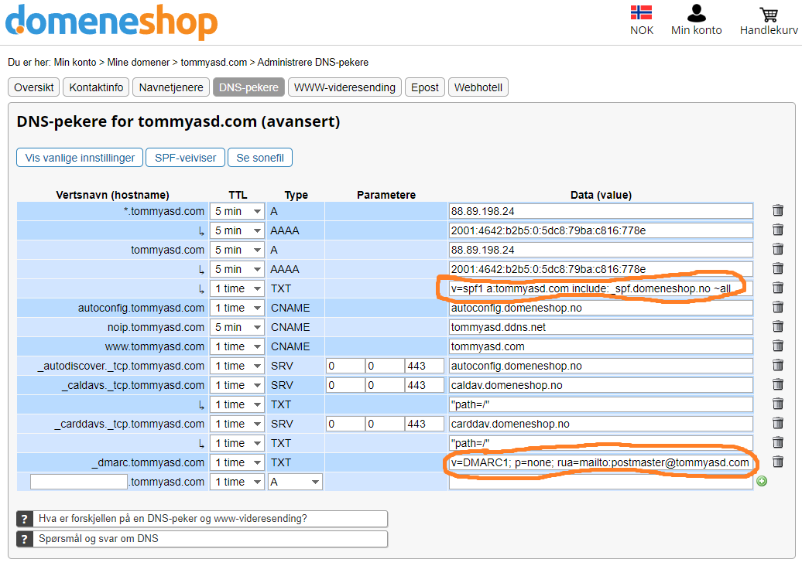
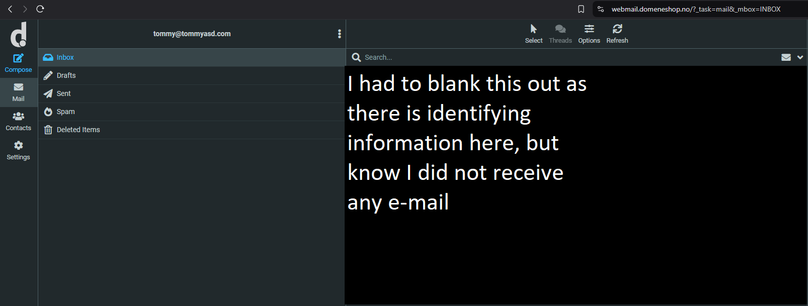
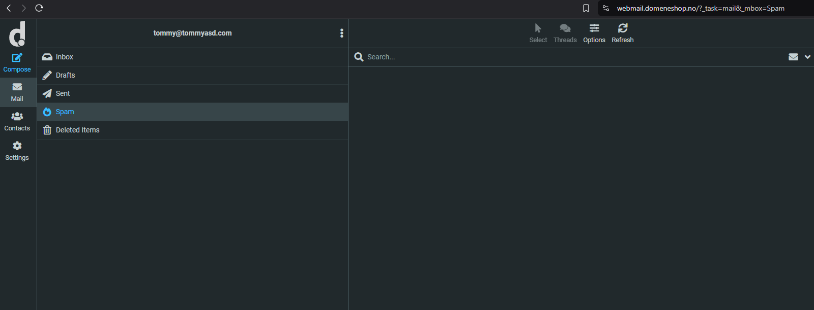
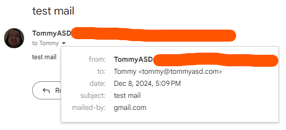
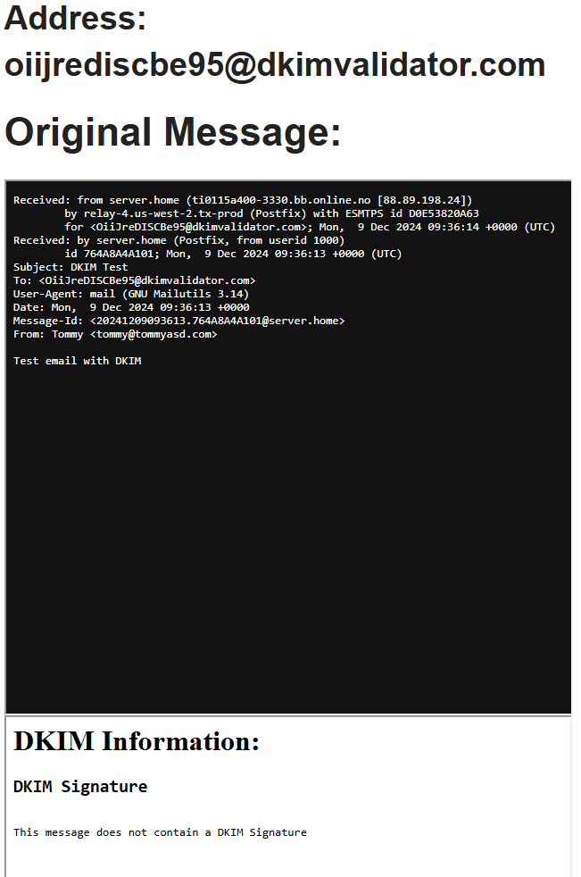
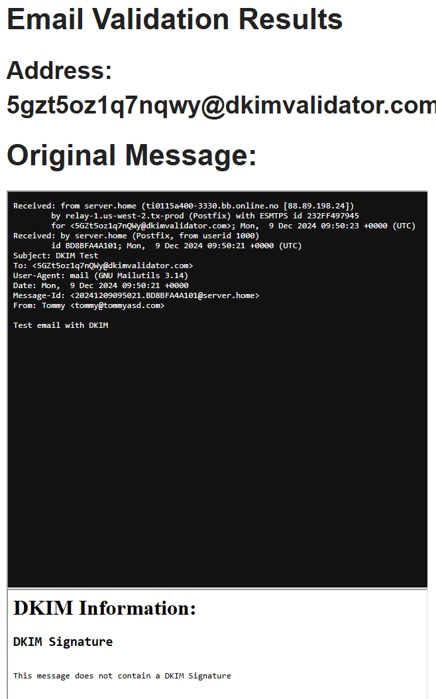
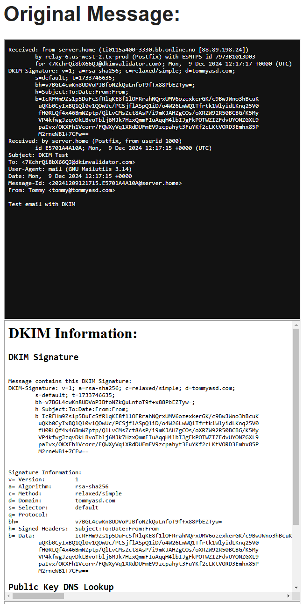

# I decided to try to set up an e-mail service on my server
## Not for any particular reason, just because it'd be funny
### Ok maybe slightly because I wanted to feel cool getting crontab reports on my e-mail
To clarify; I know nearly nothing about how the e-mail system works, but this experience has sparked my interest for it.

### Installing Postfix and Mailutils
First things first, I had to install and set up the required software. This was Postfix and Mailutils.
Postfix is a mail transfer agent (MTA for short) used to send and receive e-meials, and Mailutils provides tools for handling e-mails from the command line. How these pieces of software work, I don't yet know, but I plan to dig deeper into that.
```
tommy@server:~$ sudo apt install postfix mailutils
Reading package lists... Done
Building dependency tree... Done
Reading state information... Done
The following packages were automatically installed and are no longer required:
  galera-4 libconfig-inifiles-perl libdbd-mysql-perl libmariadb3 mariadb-common socat
Use 'sudo apt autoremove' to remove them.
The following additional packages will be installed:
  gsasl-common guile-3.0-libs libgc1 libgsasl7 libmailutils8 libntlm0 libpq5 mailutils-common
Suggested packages:
  mailutils-mh mailutils-doc procmail postfix-mysql postfix-pgsql postfix-ldap postfix-pcre postfix-lmdb postfix-sqlite sasl2-bin | dovecot-common resolvconf postfix-cdb postfix-mta-sts-resolver postfix-doc
The following NEW packages will be installed:
  gsasl-common guile-3.0-libs libgc1 libgsasl7 libmailutils8 libntlm0 libpq5 mailutils mailutils-common postfix
0 upgraded, 10 newly installed, 0 to remove and 0 not upgraded.
Need to get 10.3 MB of archives.
After this operation, 63.9 MB of additional disk space will be used.
Do you want to continue? [Y/n] y
Get:1 http://no.archive.ubuntu.com/ubuntu jammy-updates/main amd64 postfix amd64 3.6.4-1ubuntu1.3 [1,248 kB]
Get:2 http://no.archive.ubuntu.com/ubuntu jammy/universe amd64 gsasl-common all 1.10.0-5 [59.8 kB]
Get:3 http://no.archive.ubuntu.com/ubuntu jammy/main amd64 libgc1 amd64 1:8.0.6-1.1build1 [96.8 kB]
Get:4 http://no.archive.ubuntu.com/ubuntu jammy/universe amd64 guile-3.0-libs amd64 3.0.7-1 [7,538 kB]
Get:5 http://no.archive.ubuntu.com/ubuntu jammy/universe amd64 libntlm0 amd64 1.6-4 [73.7 kB]
Get:6 http://no.archive.ubuntu.com/ubuntu jammy/universe amd64 libgsasl7 amd64 1.10.0-5 [71.1 kB]
Get:7 http://no.archive.ubuntu.com/ubuntu jammy/universe amd64 mailutils-common all 1:3.14-1 [382 kB]
Get:8 http://no.archive.ubuntu.com/ubuntu jammy-updates/main amd64 libpq5 amd64 14.15-0ubuntu0.22.04.1 [150 kB]
Get:9 http://no.archive.ubuntu.com/ubuntu jammy/universe amd64 libmailutils8 amd64 1:3.14-1 [519 kB]
Get:10 http://no.archive.ubuntu.com/ubuntu jammy/universe amd64 mailutils amd64 1:3.14-1 [130 kB]
Fetched 10.3 MB in 0s (22.5 MB/s)
Preconfiguring packages ...
Selecting previously unselected package postfix.
(Reading database ... 247481 files and directories currently installed.)
Preparing to unpack .../0-postfix_3.6.4-1ubuntu1.3_amd64.deb ...
Unpacking postfix (3.6.4-1ubuntu1.3) ...
Selecting previously unselected package gsasl-common.
Preparing to unpack .../1-gsasl-common_1.10.0-5_all.deb ...
Unpacking gsasl-common (1.10.0-5) ...
Selecting previously unselected package libgc1:amd64.
Preparing to unpack .../2-libgc1_1%3a8.0.6-1.1build1_amd64.deb ...
Unpacking libgc1:amd64 (1:8.0.6-1.1build1) ...
Selecting previously unselected package guile-3.0-libs:amd64.
Preparing to unpack .../3-guile-3.0-libs_3.0.7-1_amd64.deb ...
Unpacking guile-3.0-libs:amd64 (3.0.7-1) ...
Selecting previously unselected package libntlm0:amd64.
Preparing to unpack .../4-libntlm0_1.6-4_amd64.deb ...
Unpacking libntlm0:amd64 (1.6-4) ...
Selecting previously unselected package libgsasl7:amd64.
Preparing to unpack .../5-libgsasl7_1.10.0-5_amd64.deb ...
Unpacking libgsasl7:amd64 (1.10.0-5) ...
Selecting previously unselected package mailutils-common.
Preparing to unpack .../6-mailutils-common_1%3a3.14-1_all.deb ...
Unpacking mailutils-common (1:3.14-1) ...
Selecting previously unselected package libpq5:amd64.
Preparing to unpack .../7-libpq5_14.15-0ubuntu0.22.04.1_amd64.deb ...
Unpacking libpq5:amd64 (14.15-0ubuntu0.22.04.1) ...
Selecting previously unselected package libmailutils8:amd64.
Preparing to unpack .../8-libmailutils8_1%3a3.14-1_amd64.deb ...
Unpacking libmailutils8:amd64 (1:3.14-1) ...
Selecting previously unselected package mailutils.
Preparing to unpack .../9-mailutils_1%3a3.14-1_amd64.deb ...
Unpacking mailutils (1:3.14-1) ...
Setting up libpq5:amd64 (14.15-0ubuntu0.22.04.1) ...
Setting up libntlm0:amd64 (1.6-4) ...
Setting up mailutils-common (1:3.14-1) ...
Setting up libgc1:amd64 (1:8.0.6-1.1build1) ...
Setting up postfix (3.6.4-1ubuntu1.3) ...
Adding group `postfix' (GID 143) ...
Done.
Adding system user `postfix' (UID 130) ...
Adding new user `postfix' (UID 130) with group `postfix' ...
Not creating home directory `/var/spool/postfix'.
Creating /etc/postfix/dynamicmaps.cf
Adding group `postdrop' (GID 144) ...
Done.
setting myhostname: server.home
setting alias maps
setting alias database
changing /etc/mailname to tommyasd.com
setting myorigin
setting destinations: $myhostname, tommyasd.com, server, localhost.localdomain, localhost
setting relayhost:
setting mynetworks: 127.0.0.0/8 [::ffff:127.0.0.0]/104 [::1]/128
setting mailbox_size_limit: 0
setting recipient_delimiter: +
setting inet_interfaces: all
setting inet_protocols: all
/etc/aliases does not exist, creating it.
WARNING: /etc/aliases exists, but does not have a root alias.

Postfix (main.cf) is now set up with a default configuration.  If you need to
make changes, edit /etc/postfix/main.cf (and others) as needed.  To view
Postfix configuration values, see postconf(1).

After modifying main.cf, be sure to run 'systemctl reload postfix'.

Running newaliases
Created symlink /etc/systemd/system/multi-user.target.wants/postfix.service → /lib/systemd/system/postfix.service.
Setting up gsasl-common (1.10.0-5) ...
Setting up guile-3.0-libs:amd64 (3.0.7-1) ...
Setting up libgsasl7:amd64 (1.10.0-5) ...
Setting up libmailutils8:amd64 (1:3.14-1) ...
Setting up mailutils (1:3.14-1) ...
update-alternatives: using /usr/bin/frm.mailutils to provide /usr/bin/frm (frm) in auto mode
update-alternatives: using /usr/bin/from.mailutils to provide /usr/bin/from (from) in auto mode
update-alternatives: using /usr/bin/messages.mailutils to provide /usr/bin/messages (messages) in auto mode
update-alternatives: using /usr/bin/movemail.mailutils to provide /usr/bin/movemail (movemail) in auto mode
update-alternatives: using /usr/bin/readmsg.mailutils to provide /usr/bin/readmsg (readmsg) in auto mode
update-alternatives: using /usr/bin/dotlock.mailutils to provide /usr/bin/dotlock (dotlock) in auto mode
update-alternatives: using /usr/bin/mail.mailutils to provide /usr/bin/mailx (mailx) in auto mode
Processing triggers for rsyslog (8.2112.0-2ubuntu2.2) ...
Processing triggers for ufw (0.36.1-4ubuntu0.1) ...
Processing triggers for man-db (2.10.2-1) ...
Processing triggers for libc-bin (2.35-0ubuntu3.8) ...
Scanning processes...
Scanning processor microcode...
Scanning linux images...

Running kernel seems to be up-to-date.

The processor microcode seems to be up-to-date.

No services need to be restarted.

No containers need to be restarted.

No user sessions are running outdated binaries.

No VM guests are running outdated hypervisor (qemu) binaries on this host.
tommy@server:~$
```

After installing postfix and mailutils, I had to set my system hostname;
### Setting up necessary config on the server
Postfix and Mailutils require a hostname to work properly;
```
tommy@server:~$ sudo hostnamectl set-hostname tommyasd.com
tommy@server:~$ hostname
tommyasd.com
tommy@server:~$ echo "127.0.0.1 tommyasd.com mail" | sudo tee -a /etc/hosts
tommy@server:~$ cat /etc/hosts
127.0.0.1 localhost
127.0.1.1 server

# The following lines are desirable for IPv6 capable hosts
::1     ip6-localhost ip6-loopback
fe00::0 ip6-localnet
ff00::0 ip6-mcastprefix
ff02::1 ip6-allnodes
ff02::2 ip6-allrouters

127.0.0.1 tommyasd.com mail
tommy@tommyasd:~$
```

### Setting up SPF and DMARC


At this point, I believe I could have tried to send a test email, but it would be marked as spam. Again, I know little of how e-mail works, but with my limited knowledge I believe just about anyone can send an e-mail from any address. For e-mail clients to be sure the mail is coming from a safe and legitimate source, they use a combination of SPF, DMARC and DKIM

To avoid this, I had to set up a DMARC and SPF record, and later on a DKIM pair.

#### SPF

My SPF (Sender Policy Framework) record is `v=spf1 a:tommyasd.com include:_spf.domeneshop.no ~all`. 

An SPF record specifies which e-mail servers are authorized to send e-mails on behalf of a domain. Breaking my record down;

`v=spf1` specifies the version of SPF used.

`a:tommyasd.com` specifies that the e-mail server with the IP that tommyasd.com points to can send e-mails. Essentially, the server which tommyasd.com points to is allowed to send e-mails.

`include:_spf.domeneshop.no` appends the SPF rules defined by _spf.domeneshop.no. Essentially, any e-mail server authorized by DomainNameShop is authorized to send e-mails on behalf of tommyasd.com.

The final part defines how to handle mail that doesn't come from an authorized server. In this case, the Tilde `~` signifies a **soft fail**. E-mails from unauthorized servers aren't outright rejected, but should be marked as suspicious.

SPF is a critical part of e-mail, ensuring that the received e-mail comes from an authorized server for the domain.

#### DMARC

My DMARC (Domain-based Message Authentication, Reporting, and Conformance) record is `v=DMARC1; p=quarantine; rua=mailto:postmaster@tommyasd.com`. Breaking this down;

`v=DMARC1`, similarly to SPF, specifies the version of DMARC used.

`p=quarantine` defines what should be done when an e-mail fails DMARC authentication. As far as I'm aware, there are three options;

- None 

    No action will be taken and e-mails that fail DMARC will be delivered as usual. 

- Quarantine

    E-mails that fail DMARC are marked as spam.

- Reject

    E-mails that fail DMARC are rejected completely, never being delivered to the recipient.

`rua=mailto:postmaster@tommyasd.com` specifies where DMARC aggregate reports should be sent. These reports are sent by receiving mail servers (like Gmail or Microsoft 365), summarizing how many domains succeeded or failed DMARC checks for my domain. In this case, postmaster@tommyasd.com will receive these reports. (Sidenote, rua stands for `Reporting URI for Aggregate Reports`)


That was a lot, but initial setup is done! Now that we're through that, we can finally try sending an e-mail from the terminal!
### Sending an e-mail
```
tommy@tommyasd:~$ echo "Hello from server!" | mail -s "Test Email" tommy@tommyasd.com
tommy@tommyasd:~$ sudo tail -f /var/log/mail.log
Dec  8 04:53:48 server postfix/bounce[1437490]: E9B7EA4A0EB: sender non-delivery notification: EFD67A4A0EE
Dec  8 04:53:48 server postfix/qmgr[1435363]: EFD67A4A0EE: from=<>, size=2199, nrcpt=1 (queue active)
Dec  8 04:53:48 server postfix/qmgr[1435363]: E9B7EA4A0EB: removed
Dec  8 04:53:48 server postfix/local[1437489]: EFD67A4A0EE: to=<tommy@tommyasd.com>, relay=local, delay=0.01, delays=0/0/0/0, dsn=2.0.0, status=sent (delivered to mailbox)
Dec  8 04:53:48 server postfix/qmgr[1435363]: EFD67A4A0EE: removed
Dec  8 04:55:25 server postfix/pickup[1435362]: B3045A4A0ED: uid=1000 from=<tommy@tommyasd.com>
Dec  8 04:55:25 server postfix/cleanup[1437487]: B3045A4A0ED: message-id=<20241208045525.B3045A4A0ED@server.home>
Dec  8 04:55:25 server postfix/qmgr[1435363]: B3045A4A0ED: from=<tommy@tommyasd.com>, size=345, nrcpt=1 (queue active)
Dec  8 04:55:25 server postfix/local[1437489]: B3045A4A0ED: to=<tommy@tommyasd.com>, relay=local, delay=0.01, delays=0/0/0/0, dsn=2.0.0, status=sent (delivered to mailbox)
Dec  8 04:55:25 server postfix/qmgr[1435363]: B3045A4A0ED: removed
^C
tommy@tommyasd:~$
```
Based on the terminal output, the e-mail seems to have been sent successfully. Let's check my e-mail;



Hmmm, strange. The e-mail doesn't show up. Maybe it'll show up in sent mail?


Well my knowledge of e-mail is limited, but I do think it would be weird if it showed up in sent mail, as it was sent from the server instead of DomainNameShop webmail.

Okay, last spot I haven't checked is the spam folder. Let's check that out, then;



Not in spam, either. Huh.


Maybe because the sending and receiving address are the same? I'll try sending to my gmail, then.
```
tommy@tommyasd:~$ echo "Hello from server!" | mail -s "Test Email" redacted@gmail.com
tommy@tommyasd:~$ sudo tail -f /var/log/mail.log
Dec  8 04:55:25 server postfix/pickup[1435362]: B3045A4A0ED: uid=1000 from=<tommy@tommyasd.com>
Dec  8 04:55:25 server postfix/cleanup[1437487]: B3045A4A0ED: message-id=<20241208045525.B3045A4A0ED@server.home>
Dec  8 04:55:25 server postfix/qmgr[1435363]: B3045A4A0ED: from=<tommy@tommyasd.com>, size=345, nrcpt=1 (queue active)
Dec  8 04:55:25 server postfix/local[1437489]: B3045A4A0ED: to=<tommy@tommyasd.com>, relay=local, delay=0.01, delays=0/0/0/0, dsn=2.0.0, status=sent (delivered to mailbox)
Dec  8 04:55:25 server postfix/qmgr[1435363]: B3045A4A0ED: removed
Dec  8 04:56:41 server postfix/pickup[1435362]: 3222FA4A0ED: uid=1000 from=<tommy@tommyasd.com>
Dec  8 04:56:41 server postfix/cleanup[1437487]: 3222FA4A0ED: message-id=<20241208045641.3222FA4A0ED@server.home>
Dec  8 04:56:41 server postfix/qmgr[1435363]: 3222FA4A0ED: from=<tommy@tommyasd.com>, size=356, nrcpt=1 (queue active)
Dec  8 04:56:42 server postfix/smtp[1439862]: 3222FA4A0ED: to=<redacted@gmail.com>, relay=gmail-smtp-in.l.google.com[64.233.164.26]:25, delay=1.1, delays=0.01/0.02/0.63/0.48, dsn=2.0.0, status=sent (250 2.0.0 OK  1733633802 38308e7fff4ca-30020e0f29fsi22834841fa.305 - gsmtp)
Dec  8 04:56:42 server postfix/qmgr[1435363]: 3222FA4A0ED: removed
^C
```

Logs again indicate it was sent successfully. Checking my e-mail;


Okay, great! The e-mail was received on the other end. Maybe the problem was sending and receiving addresses being the same?
To test this theory, I tried sending a mail to one of my other e-mails, tommy@funnyduck.no;
```
tommy@tommyasd:~$ echo "Hello from server!" | mail -s "Test Email" tommy@funnyduck.no
tommy@tommyasd:~$ sudo tail -f /var/log/mail.log
Dec  8 04:58:32 server postfix/cleanup[1441503]: 9DC6EA4A0F1: message-id=<20241208045832.9DC6EA4A0F1@server.home>
Dec  8 04:58:32 server postfix/bounce[1441506]: 27D2AA4A0F0: sender non-delivery notification: 9DC6EA4A0F1
Dec  8 04:58:32 server postfix/qmgr[1435363]: 9DC6EA4A0F1: from=<>, size=2874, nrcpt=1 (queue active)
Dec  8 04:58:32 server postfix/qmgr[1435363]: 27D2AA4A0F0: removed
Dec  8 04:58:32 server postfix/local[1441507]: 9DC6EA4A0F1: to=<tommy@tommyasd.com>, relay=local, delay=0.01, delays=0/0.01/0/0, dsn=2.0.0, status=sent (delivered to mailbox)
Dec  8 04:58:32 server postfix/qmgr[1435363]: 9DC6EA4A0F1: removed
Dec  8 04:58:37 server postfix/pickup[1435362]: 557C5A4A0F0: uid=1000 from=<tommy@tommyasd.com>
Dec  8 04:58:37 server postfix/cleanup[1441503]: 557C5A4A0F0: message-id=<20241208045837.557C5A4A0F0@server.home>
Dec  8 04:58:37 server postfix/qmgr[1435363]: 557C5A4A0F0: from=<tommy@tommyasd.com>, size=345, nrcpt=1 (queue active)
Dec  8 04:58:39 server postfix/smtp[1441505]: 557C5A4A0F0: host mx.domeneshop.no[2a01:5b40:0:2204::1] said: 451 4.7.3 Please try again later. IP greylisted. (in reply to end of DATA command)
Dec  8 04:58:40 server postfix/smtp[1441505]: 557C5A4A0F0: to=<tommy@funnyduck.no>, relay=mx.domeneshop.no[194.63.252.22]:25, delay=3.3, delays=0/0/2.9/0.35, dsn=4.7.3, status=deferred (host mx.domeneshop.no[194.63.252.22] said: 451 4.7.3 Please try again later. IP greylisted. (in reply to end of DATA command)
```
Hmmm. `Dec  8 04:58:39 server postfix/smtp[1441505]: 557C5A4A0F0: host mx.domeneshop.no[2a01:5b40:0:2204::1] said: 451 4.7.3 Please try again later. IP greylisted.` My IP is greylisted? 
After a quick Google search, I learned that this is a technique by mail servers to temporarily reject emails from unknown senders. Apparently, spammers won't retry sending an e-mail after the rejection, while legitimate servers will. Apparently, waiting a while before retrying will let me through.

After about an hour waiting, spending that time writing the beginning of this blog post, I've written all my steps up until this point and can now continue setting up e-mail.
```
tommy@tommyasd:~$ echo "Hello from server!" | mail -s "Test Email" tommy@funnyduck.no
tommy@tommyasd:~$ sudo tail -f /var/log/mail.log
[sudo] password for tommy:
Dec  8 06:05:49 tommyasd postfix/pickup[1435362]: 2F562A4A0F4: uid=1000 from=<tommy>
Dec  8 06:05:49 tommyasd postfix/cleanup[1498606]: 2F562A4A0F4: message-id=<20241208060549.2F562A4A0F4@server.home>
Dec  8 06:05:49 tommyasd postfix/qmgr[1435363]: 2F562A4A0F4: from=<tommy@tommyasd.com>, size=511, nrcpt=1 (queue active)
Dec  8 06:05:49 tommyasd postfix/local[1498608]: 2F562A4A0F4: to=<root@tommyasd.com>, orig_to=<root>, relay=local, delay=0.03, delays=0.02/0.01/0/0, dsn=2.0.0, status=sent (delivered to mailbox)
Dec  8 06:05:49 tommyasd postfix/qmgr[1435363]: 2F562A4A0F4: removed
Dec  8 06:05:50 tommyasd postfix/pickup[1435362]: 63701A4A0F4: uid=1000 from=<tommy@tommyasd.com>
Dec  8 06:05:50 tommyasd postfix/cleanup[1498606]: 63701A4A0F4: message-id=<20241208060550.63701A4A0F4@server.home>
Dec  8 06:05:50 tommyasd postfix/qmgr[1435363]: 63701A4A0F4: from=<tommy@tommyasd.com>, size=345, nrcpt=1 (queue active)
Dec  8 06:05:53 tommyasd postfix/smtp[1498619]: 63701A4A0F4: to=<tommy@funnyduck.no>, relay=mx.domeneshop.no[194.63.252.29]:25, delay=3.2, delays=0.01/0.01/1.2/1.9, dsn=2.0.0, status=sent (250 2.0.0 4B865oFi030759 Message accepted for delivery)
Dec  8 06:05:53 tommyasd postfix/qmgr[1435363]: 63701A4A0F4: removed
```
Okay, `Message accepted for delivery` seems promising, let's check the inbox;


Great! The e-mail was received! But why is the original e-mail sent when I was graylisted also there?
Going back to mail /var/log/mail.log;
```
...
 8 04:58:40 server postfix/smtp[1441505]: 557C5A4A0F0: to=<tommy@funnyduck.no>, relay=mx.domeneshop.no[194.63.252.22]:25, delay=3.3, delays=0/0/2.9/0.35, dsn=4.7.3, status=deferred (host mx.domeneshop.no[194.63.252.22] said: 451 4.7.3 Please try again later. IP greylisted. (in reply to end of DATA command))
Dec  8 05:00:34 tommyasd postfix/pickup[1435362]: A8330A4A0F6: uid=1011 from=<decmc>
Dec  8 05:00:34 tommyasd postfix/cleanup[1443190]: A8330A4A0F6: message-id=<20241208050034.A8330A4A0F6@server.home>
Dec  8 05:00:34 tommyasd postfix/qmgr[1435363]: A8330A4A0F6: from=<decmc@tommyasd.com>, size=72612, nrcpt=1 (queue active)
Dec  8 05:00:34 tommyasd postfix/local[1443192]: A8330A4A0F6: to=<decmc@tommyasd.com>, orig_to=<decmc>, relay=local, delay=0.03, delays=0.02/0/0/0, dsn=2.0.0, status=sent (delivered to mailbox)
Dec  8 05:00:34 tommyasd postfix/qmgr[1435363]: A8330A4A0F6: removed
Dec  8 05:06:42 tommyasd postfix/qmgr[1435363]: 557C5A4A0F0: from=<tommy@tommyasd.com>, size=345, nrcpt=1 (queue active)
Dec  8 05:07:12 tommyasd postfix/smtp[1448637]: connect to mx.domeneshop.no[2a01:5b40:0:2204::1]:25: Connection timed out
Dec  8 05:07:42 tommyasd postfix/smtp[1448637]: connect to mx.domeneshop.no[194.63.252.28]:25: Connection timed out
Dec  8 05:08:12 tommyasd postfix/smtp[1448637]: connect to mx.domeneshop.no[194.63.252.27]:25: Connection timed out
Dec  8 05:08:42 tommyasd postfix/smtp[1448637]: connect to mx.domeneshop.no[2a01:5b40:0:2205::1]:25: Connection timed out
Dec  8 05:09:12 tommyasd postfix/smtp[1448637]: connect to mx.domeneshop.no[2a01:5b40:0:2202::1]:25: Connection timed out
Dec  8 05:09:12 tommyasd postfix/smtp[1448637]: 557C5A4A0F0: to=<tommy@funnyduck.no>, relay=none, delay=636, delays=485/0.02/150/0, dsn=4.4.1, status=deferred (connect to mx.domeneshop.no[2a01:5b40:0:2202::1]:25: Connection timed out)
Dec  8 05:21:42 tommyasd postfix/qmgr[1435363]: 557C5A4A0F0: from=<tommy@tommyasd.com>, size=345, nrcpt=1 (queue active)
Dec  8 05:22:12 tommyasd postfix/smtp[1461341]: connect to mx.domeneshop.no[194.63.252.28]:25: Connection timed out
Dec  8 05:22:42 tommyasd postfix/smtp[1461341]: connect to mx.domeneshop.no[194.63.252.29]:25: Connection timed out
Dec  8 05:22:45 tommyasd postfix/smtp[1461341]: 557C5A4A0F0: to=<tommy@funnyduck.no>, relay=mx.domeneshop.no[2a01:5b40:0:2204::1]:25, delay=1448, delays=1385/0.02/61/1.8, dsn=2.0.0, status=sent (250 2.0.0 4B85MgPV038168 Message accepted for delivery)
Dec  8 05:22:45 tommyasd postfix/qmgr[1435363]: 557C5A4A0F0: removed
```
There's some unexpected behaviour involving the decmc account, an account used for our December Minecraft server (which also never arrived). Strange. I'll have to check that out later, but first;
Seems like it automatically retried sending the e-mail! Fantastic! Curious how DomainNameShop still displays the mail as received at 04:58 when I first ran the command, but I guess I'll learn why eventually

### Recap time. 
So far we've;

Installed postfix and mailutils.

Configured hostname and similar on the server

Set up SPF and DMARC records for my domain name

Attempted to send an e-mail from `tommy@tommyasd.com` to `tommy@tommyasd.com`, which never arrived

Sent an e-mail from `tommy@tommyasd.com` to my personal gmail account, which worked immediately

Sent an e-mail from `tommy@tommyasd.com` to `tommy@funnyduck.no`, which initially got rejected due to greylisting, but after mailutils (I assume?) retried about half an hour later, it came through

Sent another e-mail from `tommy@tommyasd.com` to `tommy@funnyduck.no`, which after I was un-greylisted, immediately arrived


### Fixing the problem of e-mails to tommyasd.com root domain don't arrive
After giving ChatGPT the logs and explaining the problem, it directed my attention toward the line
`Dec  8 04:55:25 server postfix/local[1437489]: B3045A4A0ED: to=<tommy@tommyasd.com>, relay=local, delay=0.01, delays=0/0/0/0, dsn=2.0.0, status=sent (delivered to mailbox)`
More specifically, it told me `postfix/local` and `relay=local` means it is sent to the local mailbox on my server.
Let's check local mailbox to see if they've arrived there, then;
```
tommy@tommyasd:~$ mail
"/var/mail/tommy": 2 messages 2 unread
>U   1 Tommy              Sun Dec  8 04:55  17/500   Test Email
?
Return-Path: <tommy@tommyasd.com>
X-Original-To: tommy@tommyasd.com
Delivered-To: tommy@tommyasd.com
Received: by server.home (Postfix, from userid 1000)
        id B3045A4A0ED; Sun,  8 Dec 2024 04:55:25 +0000 (UTC)
Subject: Test Email
To: <tommy@tommyasd.com>
User-Agent: mail (GNU Mailutils 3.14)
Date: Sun,  8 Dec 2024 04:55:25 +0000
Message-Id: <20241208045525.B3045A4A0ED@server.home>
From: Tommy <tommy@tommyasd.com>
X-IMAPbase: 1733640003                    4
X-UID: 2
Status: O

Hello from server!

?
```
There it is! Great! Seems like it was working just fine the entire time.

Little sidetrack to check what the deal with decmc@tommyasd.com was;
```
tommy@tommyasd:~$ sudo -u decmc -i
decmc@tommyasd:~$ mail
"/var/mail/decmc": 2 messages 2 new
>N   1 Cron Daemon        Sun Dec  8 05:00 116/71542 Cron <decmc@tommyasd> zip -r /mnt/mass/decmc/backups/world.$(date +%Y%m%d%H%M%S).zip ~/world
 N   2 Cron Daemon        Sun Dec  8 06:00 116/71542 Cron <decmc@tommyasd> zip -r /mnt/mass/decmc/backups/world.$(date +%Y%m%d%H%M%S).zip ~/world
?
Return-Path: <decmc@tommyasd.com>
X-Original-To: decmc
Delivered-To: decmc@tommyasd.com
Received: by server.home (Postfix, from userid 1011)
        id A8330A4A0F6; Sun,  8 Dec 2024 05:00:34 +0000 (UTC)
From: root@tommyasd.com (Cron Daemon)
To: decmc@tommyasd.com
Subject: Cron <decmc@tommyasd> zip -r /mnt/mass/decmc/backups/world.$(date +%Y%m%d%H%M%S).zip ~/world
MIME-Version: 1.0
Content-Type: text/plain; charset=UTF-8
Content-Transfer-Encoding: 8bit
X-Cron-Env: <SHELL=/bin/sh>
X-Cron-Env: <HOME=/home/decmc>
X-Cron-Env: <LOGNAME=decmc>
Message-Id: <20241208050034.A8330A4A0F6@server.home>
Date: Sun,  8 Dec 2024 05:00:34 +0000 (UTC)

  adding: home/decmc/world/ (stored 0%)
  adding: home/decmc/world/playerdata/ (stored 0%)
  adding: home/decmc/world/playerdata/1b24f755-f6b7-45bf-9bc1-f1a804493abb.dat_old (stored 0%)
  ...
```
The mail was about crontab results? But I haven't set up any crontab jobs which involve sending e-mails?
The only jobs I have in crontab are;

`0 * * * * zip -r /mnt/mass/decmc/backups/world.$(date +\%Y\%m\%d\%H\%M\%S).zip ~/world`

`0 * * * * borg create --stats /mnt/mass/decmc/borg_repo::$(date +\%Y\%m\%d\%H\%M\%S) ~/world >> ~/borg_backup.log 2>&1`

Quick run by ChatGPT says cron will automatically send the output. I guess that's fine, I won't do anything about that.


#### Okay setting up e-mail server has been fun, but I did pull an all-nighter, and I am very tired now. I'll keep going later on.

#### Day later
Sending mail from server works wonders, but can I receive mail on the server, too? 
Testing this, I tried sending an e-mail from my Gmail account to tommy@tommyasd.com



Mail sent, let's see whether it arrived on the server;

```
tommy@tommyasd:~$ mail
No mail for tommy
tommy@tommyasd:~$
```

That doesn't seem to have worked, I assume because it's still being received at DomainNameShop. Checking there;


Eh. Mail sent from my server is still being marked as spam, can't get sidetracked now.


### Setting up DKIM
DKIM (DomainKeys Identified Mail) is necessary to ensure authenticity of your sent e-mails, adding another layer of security to prevent spoofing.
First, to set this up on my server, I have to install OpenDKIM;

```
tommy@tommyasd:~$ sudo apt install opendkim opendkim-tools
Reading package lists... Done
Building dependency tree... Done
Reading state information... Done
The following additional packages will be installed:
  libmemcached11 libmilter1.0.1 libopendbx1 libopendbx1-sqlite3 libopendkim11 librbl1 libunbound8 libvbr2
The following NEW packages will be installed:
  libmemcached11 libmilter1.0.1 libopendbx1 libopendbx1-sqlite3 libopendkim11 librbl1 libunbound8 libvbr2 opendkim opendkim-tools
0 upgraded, 10 newly installed, 0 to remove and 0 not upgraded.
Need to get 914 kB of archives.
After this operation, 2,884 kB of additional disk space will be used.
Do you want to continue? [Y/n] y
Get:1 http://no.archive.ubuntu.com/ubuntu jammy/universe amd64 libopendkim11 amd64 2.11.0~beta2-6 [62.1 kB]
Get:2 http://no.archive.ubuntu.com/ubuntu jammy/main amd64 libmemcached11 amd64 1.0.18-4.2ubuntu4 [88.2 kB]
Get:3 http://no.archive.ubuntu.com/ubuntu jammy/universe amd64 libmilter1.0.1 amd64 8.15.2-22ubuntu3 [39.9 kB]
Get:4 http://no.archive.ubuntu.com/ubuntu jammy/universe amd64 libopendbx1 amd64 1.4.6-16 [27.8 kB]
Get:5 http://no.archive.ubuntu.com/ubuntu jammy/universe amd64 librbl1 amd64 2.11.0~beta2-6 [13.3 kB]
Get:6 http://no.archive.ubuntu.com/ubuntu jammy-updates/main amd64 libunbound8 amd64 1.13.1-1ubuntu5.8 [400 kB]
Get:7 http://no.archive.ubuntu.com/ubuntu jammy/universe amd64 libvbr2 amd64 2.11.0~beta2-6 [14.8 kB]
Get:8 http://no.archive.ubuntu.com/ubuntu jammy/universe amd64 opendkim amd64 2.11.0~beta2-6 [178 kB]
Get:9 http://no.archive.ubuntu.com/ubuntu jammy/universe amd64 libopendbx1-sqlite3 amd64 1.4.6-16 [5,384 B]
Get:10 http://no.archive.ubuntu.com/ubuntu jammy/universe amd64 opendkim-tools amd64 2.11.0~beta2-6 [84.8 kB]
Fetched 914 kB in 0s (7,906 kB/s)          
Selecting previously unselected package libopendkim11:amd64.
(Reading database ... 248511 files and directories currently installed.)
Preparing to unpack .../0-libopendkim11_2.11.0~beta2-6_amd64.deb ...
Unpacking libopendkim11:amd64 (2.11.0~beta2-6) ...
Selecting previously unselected package libmemcached11:amd64.
Preparing to unpack .../1-libmemcached11_1.0.18-4.2ubuntu4_amd64.deb ...
Unpacking libmemcached11:amd64 (1.0.18-4.2ubuntu4) ...
Selecting previously unselected package libmilter1.0.1:amd64.
Preparing to unpack .../2-libmilter1.0.1_8.15.2-22ubuntu3_amd64.deb ...
Unpacking libmilter1.0.1:amd64 (8.15.2-22ubuntu3) ...
Selecting previously unselected package libopendbx1.
Preparing to unpack .../3-libopendbx1_1.4.6-16_amd64.deb ...
Unpacking libopendbx1 (1.4.6-16) ...
Selecting previously unselected package librbl1:amd64.
Preparing to unpack .../4-librbl1_2.11.0~beta2-6_amd64.deb ...
Unpacking librbl1:amd64 (2.11.0~beta2-6) ...
Selecting previously unselected package libunbound8:amd64.
Preparing to unpack .../5-libunbound8_1.13.1-1ubuntu5.8_amd64.deb ...
Unpacking libunbound8:amd64 (1.13.1-1ubuntu5.8) ...
Selecting previously unselected package libvbr2:amd64.
Preparing to unpack .../6-libvbr2_2.11.0~beta2-6_amd64.deb ...
Unpacking libvbr2:amd64 (2.11.0~beta2-6) ...
Selecting previously unselected package opendkim.
Preparing to unpack .../7-opendkim_2.11.0~beta2-6_amd64.deb ...
Unpacking opendkim (2.11.0~beta2-6) ...
Selecting previously unselected package libopendbx1-sqlite3.
Preparing to unpack .../8-libopendbx1-sqlite3_1.4.6-16_amd64.deb ...
Unpacking libopendbx1-sqlite3 (1.4.6-16) ...
Selecting previously unselected package opendkim-tools.
Preparing to unpack .../9-opendkim-tools_2.11.0~beta2-6_amd64.deb ...
Unpacking opendkim-tools (2.11.0~beta2-6) ...
Setting up libopendkim11:amd64 (2.11.0~beta2-6) ...
Setting up libopendbx1 (1.4.6-16) ...
Setting up libunbound8:amd64 (1.13.1-1ubuntu5.8) ...
Setting up libmilter1.0.1:amd64 (8.15.2-22ubuntu3) ...
Setting up libmemcached11:amd64 (1.0.18-4.2ubuntu4) ...
Setting up librbl1:amd64 (2.11.0~beta2-6) ...
Setting up libvbr2:amd64 (2.11.0~beta2-6) ...
Setting up libopendbx1-sqlite3 (1.4.6-16) ...
Setting up opendkim-tools (2.11.0~beta2-6) ...
Setting up opendkim (2.11.0~beta2-6) ...
Processing triggers for man-db (2.10.2-1) ...
Processing triggers for libc-bin (2.35-0ubuntu3.8) ...
Scanning processes...                                                                                                                                                                                                                                                                                                                                                                                                                                      
Scanning processor microcode...                                                                                                                                                                                                                                                                                                                                                                                                                            
Scanning linux images...                                                                                                                                                                                                                                                                                                                                                                                                                                   

Running kernel seems to be up-to-date.

The processor microcode seems to be up-to-date.

No services need to be restarted.

No containers need to be restarted.

No user sessions are running outdated binaries.

No VM guests are running outdated hypervisor (qemu) binaries on this host.
tommy@tommyasd:~$ 
```

Next, we need to configure OpenDKIM to integrate with Postfix and set the following values;

```conf
AutoRestart             Yes
AutoRestartRate         10/1h
Syslog                  Yes
UMask                   002
OversignHeaders         From

# KeyTable, SigningTable, and TrustedHosts paths
KeyTable                /etc/opendkim/key.table
SigningTable            /etc/opendkim/signing.table
TrustedHosts            /etc/opendkim/trusted.hosts

# Socket for communication with Postfix
Socket                  inet:8891@localhost

# Mode for signing
Mode                    sv
```

We will also need a place to store DKIM keys;

```
tommy@tommyasd:~$ sudo mkdir -p /etc/opendkim/keys/tommyasd.com
tommy@tommyasd:~$ sudo opendkim-genkey -s default -d tommyasd.com -D /etc/opendkim/keys/tommyasd.com
tommy@tommyasd:~$ 
```

For this configuration, we will need 
- a KeyTable, which maps domains to their DKIM keys
- a SigningTable, which determines which keys to use for signing e-mails
- a TrustedHosts list, which defines trusted servers that can send e-mails

```
tommy@tommyasd:~$ echo "default._domainkey.tommyasd.com tommyasd.com:default:/etc/opendkim/keys/tommyasd.com/default.private" | sudo tee -a /etc/opendkim/key.table
default._domainkey.tommyasd.com tommyasd.com:default:/etc/opendkim/keys/tommyasd.com/default.private
tommy@tommyasd:~$ echo "*@tommyasd.com default._domainkey.tommyasd.com" | sudo tee -a /etc/opendkim/signing.table
*@tommyasd.com default._domainkey.tommyasd.com
tommy@tommyasd:~$ echo "127.0.0.1" | sudo tee -a /etc/opendkim/trusted.hosts
127.0.0.1
tommy@tommyasd:~$ echo "localhost" | sudo tee -a /etc/opendkim/trusted.hosts
localhost
tommy@tommyasd:~$ echo "tommyasd.com" | sudo tee -a /etc/opendkim/trusted.hosts
tommyasd.com
tommy@tommyasd:~$ 
```

Necessary files and such is now made, we can generate the key itself. OpenDKIM has a built-in command for this, opendkim-genkey

```
tommy@tommyasd:~$ sudo opendkim-genkey -s default -d tommyasd.com -D /etc/opendkim/keys/tommyasd.com
tommy@tommyasd:~$ 
```
Breaking this command down;

-s default defnes the selector name, which appears in DNS records

-d defines the domain name

-D defines the directory where these keys will be stored

The command creates two files; `default.private`, which is the private key used on the server, and `default.txt`, which contains the public key which should be defined as a DNS TXT record for the domain.

Next, just to make sure permissions are in check, I ran the following commands;

```
tommy@tommyasd:~$ sudo chown -R opendkim:opendkim /etc/opendkim
tommy@tommyasd:~$ sudo chmod -R 600 /etc/opendkim
tommy@tommyasd:~$ 
```

This sets the entire /etc/opendkim as inaccessible by anyone but the opendkim system account, and root.

Next, I had to add the public key to a TXT record on my domain. First, I had to get the public key itself;

```
tommy@tommyasd:~$ sudo cat /etc/opendkim/keys/tommyasd.com/default.txt
default._domainkey      IN      TXT     ( "v=DKIM1; h=sha256; k=rsa; "
          "p=MIIBIjANBgkqhkiG9w0BAQEFAAOCAQ8AMIIBCgKCAQEAhpxvfMvlVrcMUus4VJ8XD1gqPh08pEwEcmuKa5qeHi1gvXC9MCPKXxQnq4C6AvtlSmbxuqEEYKJK4goE5xI5JoDykP6saDGhTSbAHDGlsH/jlwSMCLNEtyLEQ5BMzej7oGfzRY3RjtCn6TbWEBnKo6PCPG6WlwNxQnc/3NizkBF8j7zUOetkQ2KcVZep2ABQMXuZV9A3dC9J+Q"
          "+PZdrbjMQGGhLulQXZG34Jv4bjtbp98757MD6aQA/Yog8IWFbguG/T5asFTvmEHBOW6FhRANTwzPklcAFqeX88ZPACyRoMZst3PaTESKFiBzhMfVG71x2qJUjAjDYaDz+yn6ppIQIDAQAB" )  ; ----- DKIM key default for tommyasd.com
tommy@tommyasd:~$ 
```


Here, the name is `default._domainkey`, the type is `TXT` and the value is everything inside the paranthesis, combining the quoted strings into one line (`v=DKIM1; h=sha256; k=rsa; p=MIIBIjANBgkqhkiG9w0BAQEFAAOCAQ8AMIIBCgKCAQEAhpxvfMvlVrcMUus4VJ8XD1gqPh08pEwEcmuKa5qeHi1gvXC9MCPKXxQnq4C6AvtlSmbxuqEEYKJK4goE5xI5JoDykP6saDGhTSbAHDGlsH/jlwSMCLNEtyLEQ5BMzej7oGfzRY3RjtCn6TbWEBnKo6PCPG6WlwNxQnc/3NizkBF8j7zUOetkQ2KcVZep2ABQMXuZV9A3dC9J+Q+PZdrbjMQGGhLulQXZG34Jv4bjtbp98757MD6aQA/Yog8IWFbguG/T5asFTvmEHBOW6FhRANTwzPklcAFqeX88ZPACyRoMZst3PaTESKFiBzhMfVG71x2qJUjAjDYaDz+yn6ppIQIDAQAB`)

Now that we've gotten the public key, the next step is to add it as a TXT record to my domain;


The final step is to add the following lines to `/etc/postfix/main.cf` (I do not know what they do)

```
milter_protocol = 6
milter_default_action = accept
smtpd_milters = inet:localhost:8891
non_smtpd_milters = inet:localhost:8891
```

And finally, we can restart postfix and opendkim

```
tommy@tommyasd:~$ sudo systemctl restart postfix
tommy@tommyasd:~$ sudo systemctl restart opendkim
Job for opendkim.service failed because the control process exited with error code.
See "systemctl status opendkim.service" and "journalctl -xeu opendkim.service" for details.
tommy@tommyasd:~$ 
```

Fuck. OpenDKIM failed to restart. Gotta find out why, then.

```
tommy@tommyasd:~$ sudo systemctl status opendkim
× opendkim.service - OpenDKIM Milter
     Loaded: loaded (/lib/systemd/system/opendkim.service; enabled; vendor preset: enabled)
     Active: failed (Result: exit-code) since Mon 2024-12-09 09:17:53 UTC; 24s ago
       Docs: man:opendkim(8)
             man:opendkim.conf(5)
             man:opendkim-lua(3)
             man:opendkim-genkey(8)
             man:opendkim-genzone(8)
             man:opendkim-testkey(8)
             http://www.opendkim.org/docs.html
    Process: 872147 ExecStart=/usr/sbin/opendkim (code=exited, status=78)
        CPU: 6ms

Dec 09 09:17:53 tommyasd.com systemd[1]: opendkim.service: Scheduled restart job, restart counter is at 5.
Dec 09 09:17:53 tommyasd.com systemd[1]: Stopped OpenDKIM Milter.
Dec 09 09:17:53 tommyasd.com systemd[1]: opendkim.service: Start request repeated too quickly.
Dec 09 09:17:53 tommyasd.com systemd[1]: opendkim.service: Failed with result 'exit-code'.
Dec 09 09:17:53 tommyasd.com systemd[1]: Failed to start OpenDKIM Milter.
tommy@tommyasd:~$ journalctl -xeu opendkim.service
░░ Support: http://www.ubuntu.com/support
░░ 
░░ Automatic restarting of the unit opendkim.service has been scheduled, as the result for
░░ the configured Restart= setting for the unit.
Dec 09 09:17:53 tommyasd.com systemd[1]: Stopped OpenDKIM Milter.
░░ Subject: A stop job for unit opendkim.service has finished
░░ Defined-By: systemd
░░ Support: http://www.ubuntu.com/support
░░ 
░░ A stop job for unit opendkim.service has finished.
░░ 
░░ The job identifier is 23534 and the job result is done.
Dec 09 09:17:53 tommyasd.com systemd[1]: opendkim.service: Start request repeated too quickly.
Dec 09 09:17:53 tommyasd.com systemd[1]: opendkim.service: Failed with result 'exit-code'.
░░ Subject: Unit failed
░░ Defined-By: systemd
░░ Support: http://www.ubuntu.com/support
░░ 
░░ The unit opendkim.service has entered the 'failed' state with result 'exit-code'.
Dec 09 09:17:53 tommyasd.com systemd[1]: Failed to start OpenDKIM Milter.
░░ Subject: A start job for unit opendkim.service has failed
░░ Defined-By: systemd
░░ Support: http://www.ubuntu.com/support
░░ 
░░ A start job for unit opendkim.service has finished with a failure.
░░ 
░░ The job identifier is 23534 and the job result is failed.
lines 299-325/325 (END)
```

Hmm, none if this seems very useful for troubleshooting. I'll try running opendkim manually, then, maybe it'll give me something more detailed;

```
tommy@tommyasd:~$ sudo opendkim -D -x /etc/opendkim.conf
opendkim: /etc/opendkim.conf: configuration error at line 63: unrecognized parameter
tommy@tommyasd:~$ 
```

Great! Something specific! Let's see what's going on on line 63, then, by running the nl command which prints file contents along with line number;
```
tommy@tommyasd:~$ nl /etc/opendkim.conf
     1  # This is a basic configuration for signing and verifying. It can easily be
     2  # adapted to suit a basic installation. See opendkim.conf(5) and
     3  # /usr/share/doc/opendkim/examples/opendkim.conf.sample for complete
     4  # documentation of available configuration parameters.
       
     5  Syslog                  yes
     6  SyslogSuccess           yes
     7  #LogWhy                 no
       
     8  # Common signing and verification parameters. In Debian, the "From" header is
     9  # oversigned, because it is often the identity key used by reputation systems
    10  # and thus somewhat security sensitive.
    11  Canonicalization        relaxed/simple
    12  #Mode                   sv
    13  #SubDomains             no
    14  OversignHeaders         From
       
    15  # Signing domain, selector, and key (required). For example, perform signing
    16  # for domain "example.com" with selector "2020" (2020._domainkey.example.com),
    17  # using the private key stored in /etc/dkimkeys/example.private. More granular
    18  # setup options can be found in /usr/share/doc/opendkim/README.opendkim.
    19  #Domain                 example.com
    20  #Selector               2020
    21  #KeyFile                /etc/dkimkeys/example.private
       
    22  # In Debian, opendkim runs as user "opendkim". A umask of 007 is required when
    23  # using a local socket with MTAs that access the socket as a non-privileged
    24  # user (for example, Postfix). You may need to add user "postfix" to group
    25  # "opendkim" in that case.
    26  UserID                  opendkim
    27  UMask                   007
       
    28  # Socket for the MTA connection (required). If the MTA is inside a chroot jail,
    29  # it must be ensured that the socket is accessible. In Debian, Postfix runs in
    30  # a chroot in /var/spool/postfix, therefore a Unix socket would have to be
    31  # configured as shown on the last line below.
    32  #Socket                 local:/run/opendkim/opendkim.sock
    33  #Socket                 inet:8891@localhost
    34  #Socket                 inet:8891
    35  #Socket                 local:/var/spool/postfix/opendkim/opendkim.sock
       
    36  PidFile                 /run/opendkim/opendkim.pid
       
    37  # Hosts for which to sign rather than verify, default is 127.0.0.1. See the
    38  # OPERATION section of opendkim(8) for more information.
    39  #InternalHosts          192.168.0.0/16, 10.0.0.0/8, 172.16.0.0/12
       
    40  # The trust anchor enables DNSSEC. In Debian, the trust anchor file is provided
    41  # by the package dns-root-data.
    42  TrustAnchorFile         /usr/share/dns/root.key
    43  #Nameservers            127.0.0.1
       
       
    44  AutoRestart             Yes
    45  AutoRestartRate         10/1h
    46  Syslog                  Yes
    47  UMask                   002
    48  OversignHeaders         From
       
    49  # KeyTable, SigningTable, and TrustedHosts paths
    50  KeyTable                /etc/opendkim/key.table
    51  SigningTable            /etc/opendkim/signing.table
    52  TrustedHosts            /etc/opendkim/trusted.hosts
       
    53  # Socket for communication with Postfix
    54  Socket                  inet:8891@localhost
       
    55  # Mode for signing
    56  Mode                    sv
tommy@tommyasd:~$ 
```

Okay... only 56 lines in the file? How come there's an error on line 63, then??
Ohhhhhh I've just spent the last 2 minutes thinking about this and of course, nl only counts the lines with content in them. If they're empty, the counter doesn't go up. Trying with cat;

```
tommy@tommyasd:~$ cat -n /etc/opendkim.conf
     1  # This is a basic configuration for signing and verifying. It can easily be
     2  # adapted to suit a basic installation. See opendkim.conf(5) and
     3  # /usr/share/doc/opendkim/examples/opendkim.conf.sample for complete
     4  # documentation of available configuration parameters.
     5
     6  Syslog                  yes
     7  SyslogSuccess           yes
     8  #LogWhy                 no
     9
    10  # Common signing and verification parameters. In Debian, the "From" header is
    11  # oversigned, because it is often the identity key used by reputation systems
    12  # and thus somewhat security sensitive.
    13  Canonicalization        relaxed/simple
    14  #Mode                   sv
    15  #SubDomains             no
    16  OversignHeaders         From
    17
    18  # Signing domain, selector, and key (required). For example, perform signing
    19  # for domain "example.com" with selector "2020" (2020._domainkey.example.com),
    20  # using the private key stored in /etc/dkimkeys/example.private. More granular
    21  # setup options can be found in /usr/share/doc/opendkim/README.opendkim.
    22  #Domain                 example.com
    23  #Selector               2020
    24  #KeyFile                /etc/dkimkeys/example.private
    25
    26  # In Debian, opendkim runs as user "opendkim". A umask of 007 is required when
    27  # using a local socket with MTAs that access the socket as a non-privileged
    28  # user (for example, Postfix). You may need to add user "postfix" to group
    29  # "opendkim" in that case.
    30  UserID                  opendkim
    31  UMask                   007
    32
    33  # Socket for the MTA connection (required). If the MTA is inside a chroot jail,
    34  # it must be ensured that the socket is accessible. In Debian, Postfix runs in
    35  # a chroot in /var/spool/postfix, therefore a Unix socket would have to be
    36  # configured as shown on the last line below.
    37  #Socket                 local:/run/opendkim/opendkim.sock
    38  #Socket                 inet:8891@localhost
    39  #Socket                 inet:8891
    40  #Socket                 local:/var/spool/postfix/opendkim/opendkim.sock
    41
    42  PidFile                 /run/opendkim/opendkim.pid
    43
    44  # Hosts for which to sign rather than verify, default is 127.0.0.1. See the
    45  # OPERATION section of opendkim(8) for more information.
    46  #InternalHosts          192.168.0.0/16, 10.0.0.0/8, 172.16.0.0/12
    47
    48  # The trust anchor enables DNSSEC. In Debian, the trust anchor file is provided
    49  # by the package dns-root-data.
    50  TrustAnchorFile         /usr/share/dns/root.key
    51  #Nameservers            127.0.0.1
    52
    53
    54  AutoRestart             Yes
    55  AutoRestartRate         10/1h
    56  #Syslog                  Yes
    57  #UMask                   002
    58  OversignHeaders         From
    59
    60  # KeyTable, SigningTable, and TrustedHosts paths
    61  KeyTable                /etc/opendkim/key.table
    62  SigningTable            /etc/opendkim/signing.table
    63  TrustedHosts            /etc/opendkim/trusted.hosts
    64
    65  # Socket for communication with Postfix
    66  Socket                  inet:8891@localhost
    67
    68  # Mode for signing
    69  Mode                    sv
tommy@tommyasd:~$ 
```

Great! Seems like the problem is with TrustedHosts, then. I guess we'll just try commenting it out, see what happens.

```
tommy@tommyasd:~$ sudo opendkim -D -x /etc/opendkim.conf
tommy@tommyasd:~$ 
```

That immediately worked! Trying to start the opendkim service, then

```
tommy@tommyasd:~$ sudo systemctl restart postfix
tommy@tommyasd:~$ sudo systemctl restart opendkim
tommy@tommyasd:~$ 
```

Seems to have restarted successfully!

Okay, great. If all was successful, DKIM signing should be working. There's a service (DKIMValidator)[https://dkimvalidator.com/] which helps you check if DKIM signing is working correctly.



All right, then. DKIM signing failed. Just to rule out the simple errors, I'll start off by checking opendkim status;

```
tommy@tommyasd:~$ sudo journalctl -u opendkim.service
...
Dec 09 09:33:45 tommyasd.com opendkim[890802]: OpenDKIM Filter: Unable to bind to port inet:8891@localhost: Address already in use
Dec 09 09:33:45 tommyasd.com opendkim[890802]: OpenDKIM Filter: Unable to create listening socket on conn inet:8891@localhost
Dec 09 09:33:45 tommyasd.com opendkim[890802]: smfi_opensocket() failed
Dec 09 09:33:45 tommyasd.com opendkim[890801]: exited with status 69, restarting
tommy@tommyasd:~$ 
```

Oh ok so OpenDKIM isn't running, that explains why DKIM failed. Something's already listening on 8891? Let's see what that is, then

```
tommy@tommyasd:~$ sudo lsof -i :8891
COMMAND     PID     USER   FD   TYPE  DEVICE SIZE/OFF NODE NAME
opendkim 889407 opendkim    3u  IPv4 3287245      0t0  TCP localhost:8891 (LISTEN)
tommy@tommyasd:~$ 
```

I thought OpenDKIM failed to start? Let's just try

```
tommy@tommyasd:~$ sudo lsof -i :8891
COMMAND     PID     USER   FD   TYPE  DEVICE SIZE/OFF NODE NAME
opendkim 889407 opendkim    3u  IPv4 3287245      0t0  TCP localhost:8891 (LISTEN)
tommy@tommyasd:~$ sudo systemctl stop opendkim
tommy@tommyasd:~$ sudo lsof -i :8891
COMMAND     PID     USER   FD   TYPE  DEVICE SIZE/OFF NODE NAME
opendkim 889407 opendkim    3u  IPv4 3287245      0t0  TCP localhost:8891 (LISTEN)
tommy@tommyasd:~$ sudo kill -9 889407
tommy@tommyasd:~$ sudo lsof -i :8891
COMMAND     PID     USER   FD   TYPE  DEVICE SIZE/OFF NODE NAME
opendkim 905214 opendkim    4u  IPv4 3363543      0t0  TCP localhost:8891 (LISTEN)
tommy@tommyasd:~$ sudo killall opendkim
tommy@tommyasd:~$ sudo lsof -i :8891
tommy@tommyasd:~$ 
```

Damn, what a hassle to kill the OpenDKIM process, but it's dead now. Let's try restarting now, then;

```
tommy@tommyasd:~$ sudo systemctl start opendkim
tommy@tommyasd:~$ sudo systemctl status opendkim
● opendkim.service - OpenDKIM Milter
     Loaded: loaded (/lib/systemd/system/opendkim.service; enabled; vendor preset: enabled)
     Active: active (running) since Mon 2024-12-09 09:49:07 UTC; 3s ago
       Docs: man:opendkim(8)
             man:opendkim.conf(5)
             man:opendkim-lua(3)
             man:opendkim-genkey(8)
             man:opendkim-genzone(8)
             man:opendkim-testkey(8)
             http://www.opendkim.org/docs.html
    Process: 908307 ExecStart=/usr/sbin/opendkim (code=exited, status=0/SUCCESS)
   Main PID: 908308 (opendkim)
      Tasks: 7 (limit: 154302)
     Memory: 2.4M
        CPU: 12ms
     CGroup: /system.slice/opendkim.service
             ├─908308 /usr/sbin/opendkim
             └─908309 /usr/sbin/opendkim

Dec 09 09:49:07 tommyasd.com systemd[1]: Starting OpenDKIM Milter...
Dec 09 09:49:07 tommyasd.com systemd[1]: Started OpenDKIM Milter.
Dec 09 09:49:07 tommyasd.com opendkim[908309]: OpenDKIM Filter v2.11.0 starting
tommy@tommyasd:~$
```

Great! Seems to be working correctly, finally. Let's try the DKIM validator again, now that OpenDKIM seems to be running correctly;



Same old, same old, still no DKIM signature, but why not?
A little while of troubleshooting later, I've realized maybe the problem is with TrustedHosts which we commented out earlier?
I updated /etc/opendkim.conf to be the following;

```
# KeyTable, SigningTable, and TrustedHosts paths
KeyTable                /etc/opendkim/key.table
SigningTable            /etc/opendkim/signing.table
#TrustedHosts            /etc/opendkim/trusted.hosts
ExternalIgnoreList /etc/opendkim/trusted.hosts
InternalHosts /etc/opendkim/trusted.hosts
```

After restarting both postfix and opendkim, it still isn't working.
Another two hours of troubleshooting later, I learned that there is a parameter `LogWhy` in /etc/opendkim.conf, which when set to yes provides more detailed logging. Finally, after all this time, I have a clear debugging path.
```
Dec 09 11:59:25 tommyasd.com opendkim[70121]: OpenDKIM Filter v2.11.0 starting
Dec 09 11:59:35 tommyasd.com opendkim[70121]: 17DE8A4A10B: no signing table match for 'tommy@tommyasd.com'
Dec 09 11:59:35 tommyasd.com opendkim[70121]: 17DE8A4A10B: no signature data

tommy@tommyasd:~$ 
```

Some trail and error later, the following lines showed up in logs while running `sudo journalctl -u opendkim -f`;
```
Dec 09 12:06:40 tommyasd.com opendkim[79293]: OpenDKIM Filter v2.11.0 starting
Dec 09 12:06:46 tommyasd.com opendkim[79293]: can't load key from /etc/opendkim/keys/tommyasd.com/default.private: Permission denied
Dec 09 12:06:46 tommyasd.com opendkim[79293]: 56B4BA4A10A: error loading key 'default._domainkey.tommyasd.com'
```

Okay... so OpenDKM doesn't have necessary permissions for the private key? But I've given it ownership and read permissions for the entire folder?
```
tommy@tommyasd:~$ sudo ls -l /etc/opendkim/keys/tommyasd.com/
total 8
-rw------- 1 opendkim opendkim 1704 Dec  9 09:02 default.private
-rw------- 1 opendkim opendkim  508 Dec  9 09:02 default.txt
tommy@tommyasd:~$ sudo ls -ld /etc /etc/opendkim /etc/opendkim/keys /etc/opendkim/keys/tommyasd.com
drwxr-xr-x 176 root     root     12288 Dec  9 12:01 /etc
drw-------   3 opendkim opendkim  4096 Dec  9 12:05 /etc/opendkim
drw-------   3 opendkim opendkim  4096 Dec  9 08:48 /etc/opendkim/keys
drw-------   2 opendkim opendkim  4096 Dec  9 09:20 /etc/opendkim/keys/tommyasd.com
tommy@tommyasd:~$ 
```

Yeah, it looks like it should have permissions?

Some more trail and error with permissions later, I tried the following;
```
tommy@tommyasd:~$ sudo chmod 777 -R /etc/opendkim
tommy@tommyasd:~$ echo "Test email with DKIM" | mail -s "DKIM Test" tommy.aleksander.sd@gmail.com
Dec 09 12:12:10 tommyasd.com opendkim[79293]: default._domainkey.tommyasd.com: key data is not secure: /etc/opendkim can be read or written by other users
Dec 09 12:12:10 tommyasd.com opendkim[79293]: 25137A4A11D: error loading key 'default._domainkey.tommyasd.com'
```
Okay, it can finally read the file with 777 (read, write, execute) permissions, but it's failing as literally everyone on this server can now read the file

```
tommy@tommyasd:~$ sudo chmod 666 -R /etc/opendkim
tommy@tommyasd:~$ echo "Test email with DKIM" | mail -s "DKIM Test" tommy.aleksander.sd@gmail.com
Dec 09 12:12:32 tommyasd.com opendkim[79293]: can't load key from /etc/opendkim/keys/tommyasd.com/default.private: Permission denied
Dec 09 12:12:32 tommyasd.com opendkim[79293]: 79988A4A12B: error loading key 'default._domainkey.tommyasd.com'
```
Hmmm, 666 permissions is failing? But literally everyone has read/write access. Is execute permissions essential?

```
tommy@tommyasd:~$ sudo chmod 700 -R /etc/opendkim
tommy@tommyasd:~$ echo "Test email with DKIM" | mail -s "DKIM Test" tommy.aleksander.sd@gmail.com
Dec 09 12:12:44 tommyasd.com opendkim[79293]: 90BEBA4A12D: DKIM-Signature field added (s=default, d=tommyasd.com)
```
OH SHIT. It worked? It fucking worked?? Missing execute permissions was the problem the entire time??
Alright, don't get too excited now, we've yet to see whether it *actually* worked. Let's test dkimvalidator.com again.

```
tommy@tommyasd:~$ echo "Test email with DKIM" | mail -s "DKIM Test" 7KchrQi8bX66QJ@dkimvalidator.com
tommy@tommyasd:~$ 
```



IT FINALLY FUCKING WORKED! After all this time, DKIM signing is working!! Jesus that took a while, but we're done! Hell yeah!

