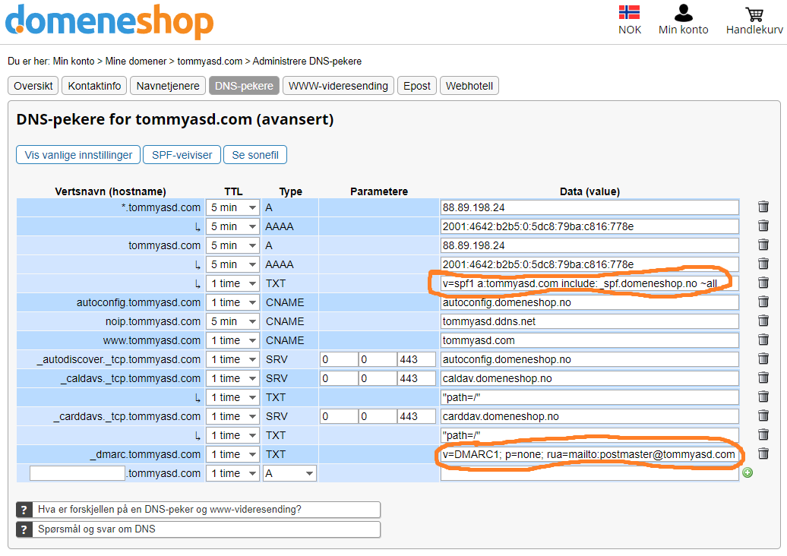
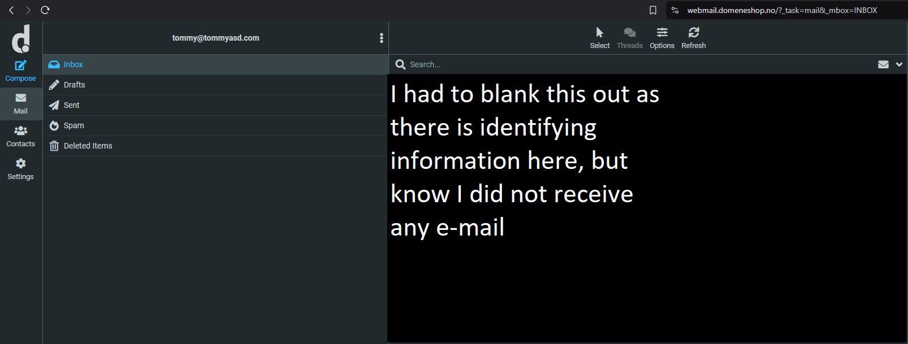
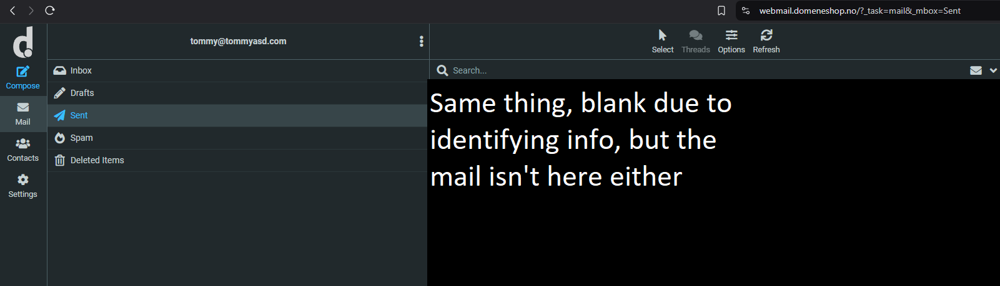
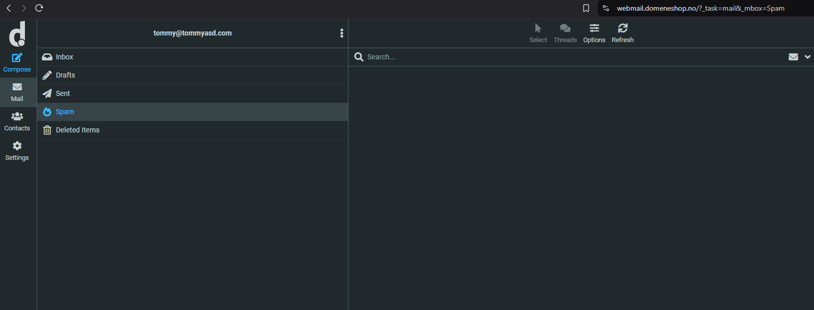
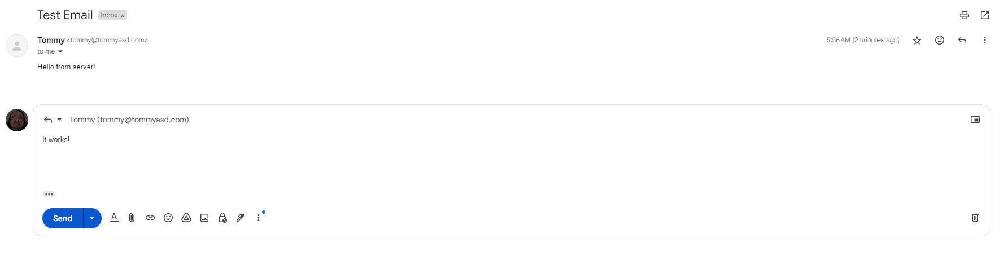
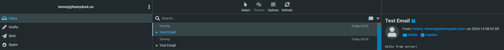
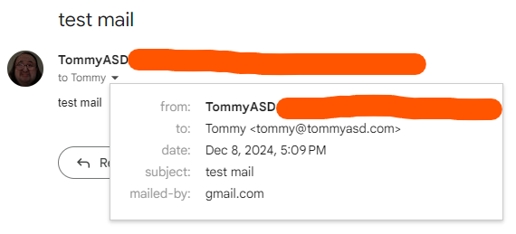

# I decided to try to set up an e-mail service on my server
## Not for any particular reason, just because it'd be funny
### Ok maybe slightly because I wanted to feel cool getting crontab reports on my e-mail
To clarify; I know nearly nothing about how the e-mail system works, but this experience has sparked my interest for it.

### Installing Postfix and Mailutils
First things first, I had to install and set up the required software. This was Postfix and Mailutils.
Postfix is a mail transfer agent (MTA for short) used to send and receive e-meials, and Mailutils provides tools for handling e-mails from the command line. How these pieces of software work, I don't yet know, but I plan to dig deeper into that.
```
tommy@server:~$ sudo apt install postfix mailutils
Reading package lists... Done
Building dependency tree... Done
Reading state information... Done
The following packages were automatically installed and are no longer required:
  galera-4 libconfig-inifiles-perl libdbd-mysql-perl libmariadb3 mariadb-common socat
Use 'sudo apt autoremove' to remove them.
The following additional packages will be installed:
  gsasl-common guile-3.0-libs libgc1 libgsasl7 libmailutils8 libntlm0 libpq5 mailutils-common
Suggested packages:
  mailutils-mh mailutils-doc procmail postfix-mysql postfix-pgsql postfix-ldap postfix-pcre postfix-lmdb postfix-sqlite sasl2-bin | dovecot-common resolvconf postfix-cdb postfix-mta-sts-resolver postfix-doc
The following NEW packages will be installed:
  gsasl-common guile-3.0-libs libgc1 libgsasl7 libmailutils8 libntlm0 libpq5 mailutils mailutils-common postfix
0 upgraded, 10 newly installed, 0 to remove and 0 not upgraded.
Need to get 10.3 MB of archives.
After this operation, 63.9 MB of additional disk space will be used.
Do you want to continue? [Y/n] y
Get:1 http://no.archive.ubuntu.com/ubuntu jammy-updates/main amd64 postfix amd64 3.6.4-1ubuntu1.3 [1,248 kB]
Get:2 http://no.archive.ubuntu.com/ubuntu jammy/universe amd64 gsasl-common all 1.10.0-5 [59.8 kB]
Get:3 http://no.archive.ubuntu.com/ubuntu jammy/main amd64 libgc1 amd64 1:8.0.6-1.1build1 [96.8 kB]
Get:4 http://no.archive.ubuntu.com/ubuntu jammy/universe amd64 guile-3.0-libs amd64 3.0.7-1 [7,538 kB]
Get:5 http://no.archive.ubuntu.com/ubuntu jammy/universe amd64 libntlm0 amd64 1.6-4 [73.7 kB]
Get:6 http://no.archive.ubuntu.com/ubuntu jammy/universe amd64 libgsasl7 amd64 1.10.0-5 [71.1 kB]
Get:7 http://no.archive.ubuntu.com/ubuntu jammy/universe amd64 mailutils-common all 1:3.14-1 [382 kB]
Get:8 http://no.archive.ubuntu.com/ubuntu jammy-updates/main amd64 libpq5 amd64 14.15-0ubuntu0.22.04.1 [150 kB]
Get:9 http://no.archive.ubuntu.com/ubuntu jammy/universe amd64 libmailutils8 amd64 1:3.14-1 [519 kB]
Get:10 http://no.archive.ubuntu.com/ubuntu jammy/universe amd64 mailutils amd64 1:3.14-1 [130 kB]
Fetched 10.3 MB in 0s (22.5 MB/s)
Preconfiguring packages ...
Selecting previously unselected package postfix.
(Reading database ... 247481 files and directories currently installed.)
Preparing to unpack .../0-postfix_3.6.4-1ubuntu1.3_amd64.deb ...
Unpacking postfix (3.6.4-1ubuntu1.3) ...
Selecting previously unselected package gsasl-common.
Preparing to unpack .../1-gsasl-common_1.10.0-5_all.deb ...
Unpacking gsasl-common (1.10.0-5) ...
Selecting previously unselected package libgc1:amd64.
Preparing to unpack .../2-libgc1_1%3a8.0.6-1.1build1_amd64.deb ...
Unpacking libgc1:amd64 (1:8.0.6-1.1build1) ...
Selecting previously unselected package guile-3.0-libs:amd64.
Preparing to unpack .../3-guile-3.0-libs_3.0.7-1_amd64.deb ...
Unpacking guile-3.0-libs:amd64 (3.0.7-1) ...
Selecting previously unselected package libntlm0:amd64.
Preparing to unpack .../4-libntlm0_1.6-4_amd64.deb ...
Unpacking libntlm0:amd64 (1.6-4) ...
Selecting previously unselected package libgsasl7:amd64.
Preparing to unpack .../5-libgsasl7_1.10.0-5_amd64.deb ...
Unpacking libgsasl7:amd64 (1.10.0-5) ...
Selecting previously unselected package mailutils-common.
Preparing to unpack .../6-mailutils-common_1%3a3.14-1_all.deb ...
Unpacking mailutils-common (1:3.14-1) ...
Selecting previously unselected package libpq5:amd64.
Preparing to unpack .../7-libpq5_14.15-0ubuntu0.22.04.1_amd64.deb ...
Unpacking libpq5:amd64 (14.15-0ubuntu0.22.04.1) ...
Selecting previously unselected package libmailutils8:amd64.
Preparing to unpack .../8-libmailutils8_1%3a3.14-1_amd64.deb ...
Unpacking libmailutils8:amd64 (1:3.14-1) ...
Selecting previously unselected package mailutils.
Preparing to unpack .../9-mailutils_1%3a3.14-1_amd64.deb ...
Unpacking mailutils (1:3.14-1) ...
Setting up libpq5:amd64 (14.15-0ubuntu0.22.04.1) ...
Setting up libntlm0:amd64 (1.6-4) ...
Setting up mailutils-common (1:3.14-1) ...
Setting up libgc1:amd64 (1:8.0.6-1.1build1) ...
Setting up postfix (3.6.4-1ubuntu1.3) ...
Adding group `postfix' (GID 143) ...
Done.
Adding system user `postfix' (UID 130) ...
Adding new user `postfix' (UID 130) with group `postfix' ...
Not creating home directory `/var/spool/postfix'.
Creating /etc/postfix/dynamicmaps.cf
Adding group `postdrop' (GID 144) ...
Done.
setting myhostname: server.home
setting alias maps
setting alias database
changing /etc/mailname to tommyasd.com
setting myorigin
setting destinations: $myhostname, tommyasd.com, server, localhost.localdomain, localhost
setting relayhost:
setting mynetworks: 127.0.0.0/8 [::ffff:127.0.0.0]/104 [::1]/128
setting mailbox_size_limit: 0
setting recipient_delimiter: +
setting inet_interfaces: all
setting inet_protocols: all
/etc/aliases does not exist, creating it.
WARNING: /etc/aliases exists, but does not have a root alias.

Postfix (main.cf) is now set up with a default configuration.  If you need to
make changes, edit /etc/postfix/main.cf (and others) as needed.  To view
Postfix configuration values, see postconf(1).

After modifying main.cf, be sure to run 'systemctl reload postfix'.

Running newaliases
Created symlink /etc/systemd/system/multi-user.target.wants/postfix.service → /lib/systemd/system/postfix.service.
Setting up gsasl-common (1.10.0-5) ...
Setting up guile-3.0-libs:amd64 (3.0.7-1) ...
Setting up libgsasl7:amd64 (1.10.0-5) ...
Setting up libmailutils8:amd64 (1:3.14-1) ...
Setting up mailutils (1:3.14-1) ...
update-alternatives: using /usr/bin/frm.mailutils to provide /usr/bin/frm (frm) in auto mode
update-alternatives: using /usr/bin/from.mailutils to provide /usr/bin/from (from) in auto mode
update-alternatives: using /usr/bin/messages.mailutils to provide /usr/bin/messages (messages) in auto mode
update-alternatives: using /usr/bin/movemail.mailutils to provide /usr/bin/movemail (movemail) in auto mode
update-alternatives: using /usr/bin/readmsg.mailutils to provide /usr/bin/readmsg (readmsg) in auto mode
update-alternatives: using /usr/bin/dotlock.mailutils to provide /usr/bin/dotlock (dotlock) in auto mode
update-alternatives: using /usr/bin/mail.mailutils to provide /usr/bin/mailx (mailx) in auto mode
Processing triggers for rsyslog (8.2112.0-2ubuntu2.2) ...
Processing triggers for ufw (0.36.1-4ubuntu0.1) ...
Processing triggers for man-db (2.10.2-1) ...
Processing triggers for libc-bin (2.35-0ubuntu3.8) ...
Scanning processes...
Scanning processor microcode...
Scanning linux images...

Running kernel seems to be up-to-date.

The processor microcode seems to be up-to-date.

No services need to be restarted.

No containers need to be restarted.

No user sessions are running outdated binaries.

No VM guests are running outdated hypervisor (qemu) binaries on this host.
tommy@server:~$
```

After installing postfix and mailutils, I had to set my system hostname;
### Setting up necessary config on the server
Postfix and Mailutils require a hostname to work properly;
```
tommy@server:~$ sudo hostnamectl set-hostname tommyasd.com
tommy@server:~$ hostname
tommyasd.com
tommy@server:~$ echo "127.0.0.1 tommyasd.com mail" | sudo tee -a /etc/hosts
tommy@server:~$ cat /etc/hosts
127.0.0.1 localhost
127.0.1.1 server

# The following lines are desirable for IPv6 capable hosts
::1     ip6-localhost ip6-loopback
fe00::0 ip6-localnet
ff00::0 ip6-mcastprefix
ff02::1 ip6-allnodes
ff02::2 ip6-allrouters

127.0.0.1 tommyasd.com mail
tommy@tommyasd:~$
```

### Setting up SPF and DMARC


At this point, I believe I could have tried to send a test email, but it would be marked as spam. Again, I know little of how e-mail works, but with my limited knowledge I believe just about anyone can send an e-mail from any address. For e-mail clients to be sure the mail is coming from a safe and legitimate source, they use a combination of SPF, DMARC and DKIM

To avoid this, I had to set up a DMARC and SPF record, and later on a DKIM pair.

#### SPF

My SPF (Sender Policy Framework) record is `v=spf1 a:tommyasd.com include:_spf.domeneshop.no ~all`. 

An SPF record specifies which e-mail servers are authorized to send e-mails on behalf of a domain. Breaking my record down;

`v=spf1` specifies the version of SPF used.

`a:tommyasd.com` specifies that the e-mail server with the IP that tommyasd.com points to can send e-mails. Essentially, the server which tommyasd.com points to is allowed to send e-mails.

`include:_spf.domeneshop.no` appends the SPF rules defined by _spf.domeneshop.no. Essentially, any e-mail server authorized by DomainNameShop is authorized to send e-mails on behalf of tommyasd.com.

The final part defines how to handle mail that doesn't come from an authorized server. In this case, the Tilde `~` signifies a **soft fail**. E-mails from unauthorized servers aren't outright rejected, but should be marked as suspicious.

SPF is a critical part of e-mail, ensuring that the received e-mail comes from an authorized server for the domain.

#### DMARC

My DMARC (Domain-based Message Authentication, Reporting, and Conformance) record is `v=DMARC1; p=quarantine; rua=mailto:postmaster@tommyasd.com`. Breaking this down;

`v=DMARC1`, similarly to SPF, specifies the version of DMARC used.

`p=quarantine` defines what should be done when an e-mail fails DMARC authentication. As far as I'm aware, there are three options;

- None 

    No action will be taken and e-mails that fail DMARC will be delivered as usual. 

- Quarantine

    E-mails that fail DMARC are marked as spam.

- Reject

    E-mails that fail DMARC are rejected completely, never being delivered to the recipient.

`rua=mailto:postmaster@tommyasd.com` specifies where DMARC aggregate reports should be sent. These reports are sent by receiving mail servers (like Gmail or Microsoft 365), summarizing how many domains succeeded or failed DMARC checks for my domain. In this case, postmaster@tommyasd.com will receive these reports. (Sidenote, rua stands for `Reporting URI for Aggregate Reports`)


That was a lot, but initial setup is done! Now that we're through that, we can finally try sending an e-mail from the terminal!
### Sending an e-mail
```
tommy@tommyasd:~$ echo "Hello from server!" | mail -s "Test Email" tommy@tommyasd.com
tommy@tommyasd:~$ sudo tail -f /var/log/mail.log
Dec  8 04:53:48 server postfix/bounce[1437490]: E9B7EA4A0EB: sender non-delivery notification: EFD67A4A0EE
Dec  8 04:53:48 server postfix/qmgr[1435363]: EFD67A4A0EE: from=<>, size=2199, nrcpt=1 (queue active)
Dec  8 04:53:48 server postfix/qmgr[1435363]: E9B7EA4A0EB: removed
Dec  8 04:53:48 server postfix/local[1437489]: EFD67A4A0EE: to=<tommy@tommyasd.com>, relay=local, delay=0.01, delays=0/0/0/0, dsn=2.0.0, status=sent (delivered to mailbox)
Dec  8 04:53:48 server postfix/qmgr[1435363]: EFD67A4A0EE: removed
Dec  8 04:55:25 server postfix/pickup[1435362]: B3045A4A0ED: uid=1000 from=<tommy@tommyasd.com>
Dec  8 04:55:25 server postfix/cleanup[1437487]: B3045A4A0ED: message-id=<20241208045525.B3045A4A0ED@server.home>
Dec  8 04:55:25 server postfix/qmgr[1435363]: B3045A4A0ED: from=<tommy@tommyasd.com>, size=345, nrcpt=1 (queue active)
Dec  8 04:55:25 server postfix/local[1437489]: B3045A4A0ED: to=<tommy@tommyasd.com>, relay=local, delay=0.01, delays=0/0/0/0, dsn=2.0.0, status=sent (delivered to mailbox)
Dec  8 04:55:25 server postfix/qmgr[1435363]: B3045A4A0ED: removed
^C
tommy@tommyasd:~$
```
Based on the terminal output, the e-mail seems to have been sent successfully. Let's check my e-mail;



Hmmm, strange. The e-mail doesn't show up. Maybe it'll show up in sent mail?



Well my knowledge of e-mail is limited, but I do think it would be weird if it showed up in sent mail, as it was sent from the server instead of DomainNameShop webmail.

Okay, last spot I haven't checked is the spam folder. Let's check that out, then;



Not in spam, either. Huh.


Maybe because the sending and receiving address are the same? I'll try sending to my gmail, then.
```
tommy@tommyasd:~$ echo "Hello from server!" | mail -s "Test Email" redacted@gmail.com
tommy@tommyasd:~$ sudo tail -f /var/log/mail.log
Dec  8 04:55:25 server postfix/pickup[1435362]: B3045A4A0ED: uid=1000 from=<tommy@tommyasd.com>
Dec  8 04:55:25 server postfix/cleanup[1437487]: B3045A4A0ED: message-id=<20241208045525.B3045A4A0ED@server.home>
Dec  8 04:55:25 server postfix/qmgr[1435363]: B3045A4A0ED: from=<tommy@tommyasd.com>, size=345, nrcpt=1 (queue active)
Dec  8 04:55:25 server postfix/local[1437489]: B3045A4A0ED: to=<tommy@tommyasd.com>, relay=local, delay=0.01, delays=0/0/0/0, dsn=2.0.0, status=sent (delivered to mailbox)
Dec  8 04:55:25 server postfix/qmgr[1435363]: B3045A4A0ED: removed
Dec  8 04:56:41 server postfix/pickup[1435362]: 3222FA4A0ED: uid=1000 from=<tommy@tommyasd.com>
Dec  8 04:56:41 server postfix/cleanup[1437487]: 3222FA4A0ED: message-id=<20241208045641.3222FA4A0ED@server.home>
Dec  8 04:56:41 server postfix/qmgr[1435363]: 3222FA4A0ED: from=<tommy@tommyasd.com>, size=356, nrcpt=1 (queue active)
Dec  8 04:56:42 server postfix/smtp[1439862]: 3222FA4A0ED: to=<redacted@gmail.com>, relay=gmail-smtp-in.l.google.com[64.233.164.26]:25, delay=1.1, delays=0.01/0.02/0.63/0.48, dsn=2.0.0, status=sent (250 2.0.0 OK  1733633802 38308e7fff4ca-30020e0f29fsi22834841fa.305 - gsmtp)
Dec  8 04:56:42 server postfix/qmgr[1435363]: 3222FA4A0ED: removed
^C
```

Logs again indicate it was sent successfully. Checking my e-mail;



Okay, great! The e-mail was received on the other end. Maybe the problem was sending and receiving addresses being the same?
To test this theory, I tried sending a mail to one of my other e-mails, tommy@funnyduck.no;
```
tommy@tommyasd:~$ echo "Hello from server!" | mail -s "Test Email" tommy@funnyduck.no
tommy@tommyasd:~$ sudo tail -f /var/log/mail.log
Dec  8 04:58:32 server postfix/cleanup[1441503]: 9DC6EA4A0F1: message-id=<20241208045832.9DC6EA4A0F1@server.home>
Dec  8 04:58:32 server postfix/bounce[1441506]: 27D2AA4A0F0: sender non-delivery notification: 9DC6EA4A0F1
Dec  8 04:58:32 server postfix/qmgr[1435363]: 9DC6EA4A0F1: from=<>, size=2874, nrcpt=1 (queue active)
Dec  8 04:58:32 server postfix/qmgr[1435363]: 27D2AA4A0F0: removed
Dec  8 04:58:32 server postfix/local[1441507]: 9DC6EA4A0F1: to=<tommy@tommyasd.com>, relay=local, delay=0.01, delays=0/0.01/0/0, dsn=2.0.0, status=sent (delivered to mailbox)
Dec  8 04:58:32 server postfix/qmgr[1435363]: 9DC6EA4A0F1: removed
Dec  8 04:58:37 server postfix/pickup[1435362]: 557C5A4A0F0: uid=1000 from=<tommy@tommyasd.com>
Dec  8 04:58:37 server postfix/cleanup[1441503]: 557C5A4A0F0: message-id=<20241208045837.557C5A4A0F0@server.home>
Dec  8 04:58:37 server postfix/qmgr[1435363]: 557C5A4A0F0: from=<tommy@tommyasd.com>, size=345, nrcpt=1 (queue active)
Dec  8 04:58:39 server postfix/smtp[1441505]: 557C5A4A0F0: host mx.domeneshop.no[2a01:5b40:0:2204::1] said: 451 4.7.3 Please try again later. IP greylisted. (in reply to end of DATA command)
Dec  8 04:58:40 server postfix/smtp[1441505]: 557C5A4A0F0: to=<tommy@funnyduck.no>, relay=mx.domeneshop.no[194.63.252.22]:25, delay=3.3, delays=0/0/2.9/0.35, dsn=4.7.3, status=deferred (host mx.domeneshop.no[194.63.252.22] said: 451 4.7.3 Please try again later. IP greylisted. (in reply to end of DATA command)
```
Hmmm. `Dec  8 04:58:39 server postfix/smtp[1441505]: 557C5A4A0F0: host mx.domeneshop.no[2a01:5b40:0:2204::1] said: 451 4.7.3 Please try again later. IP greylisted.` My IP is greylisted? 
After a quick Google search, I learned that this is a technique by mail servers to temporarily reject emails from unknown senders. Apparently, spammers won't retry sending an e-mail after the rejection, while legitimate servers will. Apparently, waiting a while before retrying will let me through.

After about an hour waiting, spending that time writing the beginning of this blog post, I've written all my steps up until this point and can now continue setting up e-mail.
```
tommy@tommyasd:~$ echo "Hello from server!" | mail -s "Test Email" tommy@funnyduck.no
tommy@tommyasd:~$ sudo tail -f /var/log/mail.log
[sudo] password for tommy:
Dec  8 06:05:49 tommyasd postfix/pickup[1435362]: 2F562A4A0F4: uid=1000 from=<tommy>
Dec  8 06:05:49 tommyasd postfix/cleanup[1498606]: 2F562A4A0F4: message-id=<20241208060549.2F562A4A0F4@server.home>
Dec  8 06:05:49 tommyasd postfix/qmgr[1435363]: 2F562A4A0F4: from=<tommy@tommyasd.com>, size=511, nrcpt=1 (queue active)
Dec  8 06:05:49 tommyasd postfix/local[1498608]: 2F562A4A0F4: to=<root@tommyasd.com>, orig_to=<root>, relay=local, delay=0.03, delays=0.02/0.01/0/0, dsn=2.0.0, status=sent (delivered to mailbox)
Dec  8 06:05:49 tommyasd postfix/qmgr[1435363]: 2F562A4A0F4: removed
Dec  8 06:05:50 tommyasd postfix/pickup[1435362]: 63701A4A0F4: uid=1000 from=<tommy@tommyasd.com>
Dec  8 06:05:50 tommyasd postfix/cleanup[1498606]: 63701A4A0F4: message-id=<20241208060550.63701A4A0F4@server.home>
Dec  8 06:05:50 tommyasd postfix/qmgr[1435363]: 63701A4A0F4: from=<tommy@tommyasd.com>, size=345, nrcpt=1 (queue active)
Dec  8 06:05:53 tommyasd postfix/smtp[1498619]: 63701A4A0F4: to=<tommy@funnyduck.no>, relay=mx.domeneshop.no[194.63.252.29]:25, delay=3.2, delays=0.01/0.01/1.2/1.9, dsn=2.0.0, status=sent (250 2.0.0 4B865oFi030759 Message accepted for delivery)
Dec  8 06:05:53 tommyasd postfix/qmgr[1435363]: 63701A4A0F4: removed
```
Okay, `Message accepted for delivery` seems promising, let's check the inbox;


Great! The e-mail was received! But why is the original e-mail sent when I was graylisted also there?
Going back to mail /var/log/mail.log;
```
...
 8 04:58:40 server postfix/smtp[1441505]: 557C5A4A0F0: to=<tommy@funnyduck.no>, relay=mx.domeneshop.no[194.63.252.22]:25, delay=3.3, delays=0/0/2.9/0.35, dsn=4.7.3, status=deferred (host mx.domeneshop.no[194.63.252.22] said: 451 4.7.3 Please try again later. IP greylisted. (in reply to end of DATA command))
Dec  8 05:00:34 tommyasd postfix/pickup[1435362]: A8330A4A0F6: uid=1011 from=<decmc>
Dec  8 05:00:34 tommyasd postfix/cleanup[1443190]: A8330A4A0F6: message-id=<20241208050034.A8330A4A0F6@server.home>
Dec  8 05:00:34 tommyasd postfix/qmgr[1435363]: A8330A4A0F6: from=<decmc@tommyasd.com>, size=72612, nrcpt=1 (queue active)
Dec  8 05:00:34 tommyasd postfix/local[1443192]: A8330A4A0F6: to=<decmc@tommyasd.com>, orig_to=<decmc>, relay=local, delay=0.03, delays=0.02/0/0/0, dsn=2.0.0, status=sent (delivered to mailbox)
Dec  8 05:00:34 tommyasd postfix/qmgr[1435363]: A8330A4A0F6: removed
Dec  8 05:06:42 tommyasd postfix/qmgr[1435363]: 557C5A4A0F0: from=<tommy@tommyasd.com>, size=345, nrcpt=1 (queue active)
Dec  8 05:07:12 tommyasd postfix/smtp[1448637]: connect to mx.domeneshop.no[2a01:5b40:0:2204::1]:25: Connection timed out
Dec  8 05:07:42 tommyasd postfix/smtp[1448637]: connect to mx.domeneshop.no[194.63.252.28]:25: Connection timed out
Dec  8 05:08:12 tommyasd postfix/smtp[1448637]: connect to mx.domeneshop.no[194.63.252.27]:25: Connection timed out
Dec  8 05:08:42 tommyasd postfix/smtp[1448637]: connect to mx.domeneshop.no[2a01:5b40:0:2205::1]:25: Connection timed out
Dec  8 05:09:12 tommyasd postfix/smtp[1448637]: connect to mx.domeneshop.no[2a01:5b40:0:2202::1]:25: Connection timed out
Dec  8 05:09:12 tommyasd postfix/smtp[1448637]: 557C5A4A0F0: to=<tommy@funnyduck.no>, relay=none, delay=636, delays=485/0.02/150/0, dsn=4.4.1, status=deferred (connect to mx.domeneshop.no[2a01:5b40:0:2202::1]:25: Connection timed out)
Dec  8 05:21:42 tommyasd postfix/qmgr[1435363]: 557C5A4A0F0: from=<tommy@tommyasd.com>, size=345, nrcpt=1 (queue active)
Dec  8 05:22:12 tommyasd postfix/smtp[1461341]: connect to mx.domeneshop.no[194.63.252.28]:25: Connection timed out
Dec  8 05:22:42 tommyasd postfix/smtp[1461341]: connect to mx.domeneshop.no[194.63.252.29]:25: Connection timed out
Dec  8 05:22:45 tommyasd postfix/smtp[1461341]: 557C5A4A0F0: to=<tommy@funnyduck.no>, relay=mx.domeneshop.no[2a01:5b40:0:2204::1]:25, delay=1448, delays=1385/0.02/61/1.8, dsn=2.0.0, status=sent (250 2.0.0 4B85MgPV038168 Message accepted for delivery)
Dec  8 05:22:45 tommyasd postfix/qmgr[1435363]: 557C5A4A0F0: removed
```
There's some unexpected behaviour involving the decmc account, an account used for our December Minecraft server (which also never arrived). Strange. I'll have to check that out later, but first;
Seems like it automatically retried sending the e-mail! Fantastic! Curious how DomainNameShop still displays the mail as received at 04:58 when I first ran the command, but I guess I'll learn why eventually

### Recap time. 
So far we've;

Installed postfix and mailutils.

Configured hostname and similar on the server

Set up SPF and DMARC records for my domain name

Attempted to send an e-mail from `tommy@tommyasd.com` to `tommy@tommyasd.com`, which never arrived

Sent an e-mail from `tommy@tommyasd.com` to my personal gmail account, which worked immediately

Sent an e-mail from `tommy@tommyasd.com` to `tommy@funnyduck.no`, which initially got rejected due to greylisting, but after mailutils (I assume?) retried about half an hour later, it came through

Sent another e-mail from `tommy@tommyasd.com` to `tommy@funnyduck.no`, which after I was un-greylisted, immediately arrived


### Fixing the problem of e-mails to tommyasd.com root domain don't arrive
After giving ChatGPT the logs and explaining the problem, it directed my attention toward the line
`Dec  8 04:55:25 server postfix/local[1437489]: B3045A4A0ED: to=<tommy@tommyasd.com>, relay=local, delay=0.01, delays=0/0/0/0, dsn=2.0.0, status=sent (delivered to mailbox)`
More specifically, it told me `postfix/local` and `relay=local` means it is sent to the local mailbox on my server.
Let's check local mailbox to see if they've arrived there, then;
```
tommy@tommyasd:~$ mail
"/var/mail/tommy": 2 messages 2 unread
>U   1 Tommy              Sun Dec  8 04:55  17/500   Test Email
?
Return-Path: <tommy@tommyasd.com>
X-Original-To: tommy@tommyasd.com
Delivered-To: tommy@tommyasd.com
Received: by server.home (Postfix, from userid 1000)
        id B3045A4A0ED; Sun,  8 Dec 2024 04:55:25 +0000 (UTC)
Subject: Test Email
To: <tommy@tommyasd.com>
User-Agent: mail (GNU Mailutils 3.14)
Date: Sun,  8 Dec 2024 04:55:25 +0000
Message-Id: <20241208045525.B3045A4A0ED@server.home>
From: Tommy <tommy@tommyasd.com>
X-IMAPbase: 1733640003                    4
X-UID: 2
Status: O

Hello from server!

?
```
There it is! Great! Seems like it was working just fine the entire time.

Little sidetrack to check what the deal with decmc@tommyasd.com was;
```
tommy@tommyasd:~$ sudo -u decmc -i
decmc@tommyasd:~$ mail
"/var/mail/decmc": 2 messages 2 new
>N   1 Cron Daemon        Sun Dec  8 05:00 116/71542 Cron <decmc@tommyasd> zip -r /mnt/mass/decmc/backups/world.$(date +%Y%m%d%H%M%S).zip ~/world
 N   2 Cron Daemon        Sun Dec  8 06:00 116/71542 Cron <decmc@tommyasd> zip -r /mnt/mass/decmc/backups/world.$(date +%Y%m%d%H%M%S).zip ~/world
?
Return-Path: <decmc@tommyasd.com>
X-Original-To: decmc
Delivered-To: decmc@tommyasd.com
Received: by server.home (Postfix, from userid 1011)
        id A8330A4A0F6; Sun,  8 Dec 2024 05:00:34 +0000 (UTC)
From: root@tommyasd.com (Cron Daemon)
To: decmc@tommyasd.com
Subject: Cron <decmc@tommyasd> zip -r /mnt/mass/decmc/backups/world.$(date +%Y%m%d%H%M%S).zip ~/world
MIME-Version: 1.0
Content-Type: text/plain; charset=UTF-8
Content-Transfer-Encoding: 8bit
X-Cron-Env: <SHELL=/bin/sh>
X-Cron-Env: <HOME=/home/decmc>
X-Cron-Env: <LOGNAME=decmc>
Message-Id: <20241208050034.A8330A4A0F6@server.home>
Date: Sun,  8 Dec 2024 05:00:34 +0000 (UTC)

  adding: home/decmc/world/ (stored 0%)
  adding: home/decmc/world/playerdata/ (stored 0%)
  adding: home/decmc/world/playerdata/1b24f755-f6b7-45bf-9bc1-f1a804493abb.dat_old (stored 0%)
  ...
```
The mail was about crontab results? But I haven't set up any crontab jobs which involve sending e-mails?
The only jobs I have in crontab are;

`0 * * * * zip -r /mnt/mass/decmc/backups/world.$(date +\%Y\%m\%d\%H\%M\%S).zip ~/world`

`0 * * * * borg create --stats /mnt/mass/decmc/borg_repo::$(date +\%Y\%m\%d\%H\%M\%S) ~/world >> ~/borg_backup.log 2>&1`

Quick run by ChatGPT says cron will automatically send the output. I guess that's fine, I won't do anything about that.


#### Okay setting up e-mail server has been fun, but I did pull an all-nighter, and I am very tired now. I'll keep going later on.

#### Day later
Sending mail from server works wonders, but can I receive mail on the server, too? 
Testing this, I tried sending an e-mail from my Gmail account to tommy@tommyasd.com



Mail sent, let's see whether it arrived on the server;

```
tommy@tommyasd:~$ mail
No mail for tommy
tommy@tommyasd:~$
```

That doesn't seem to have worked, I assume because it's still being received at DomainNameShop. Checking there;


